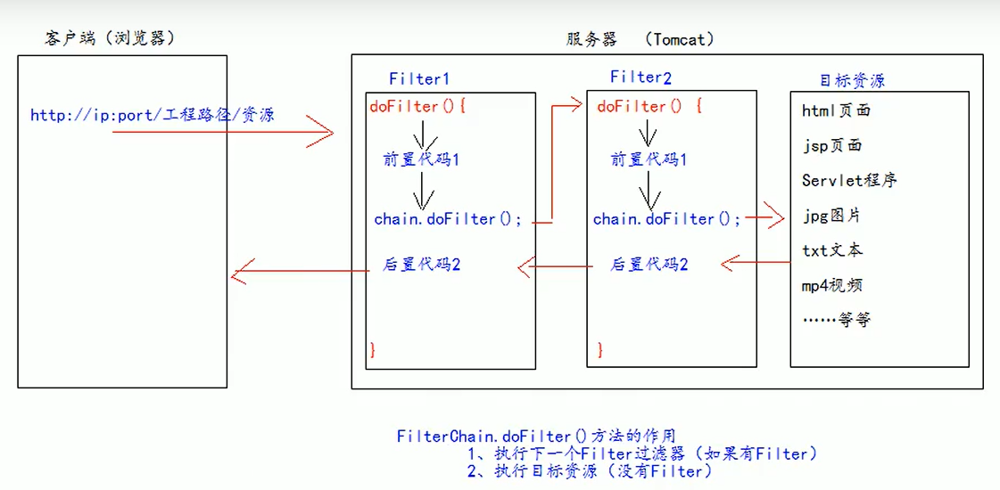

**三大组件：**

- servlet：接收请求 发出响应
- filter：拦截请求，过滤响应
- listener


### 1. filter介绍

filter是javaEE规范之一，规范就是**接口**


作用：

拦截请求，过滤响应


### 2. 实现filter程序

- 编写类 实现filter接口

  - 实现过滤方法doFilter()，编写过滤条件
  - 分别对拦截和未拦截的请求进行处理

- 在web.xml中配置

  ```xml
  <!--配置filter过滤器-->
  <filter>
  	<filter-name>AdminFilter</filter-name>
      <filter-class>xxx.AdminFilter</filter-class>
  </filter>
  
  <!--配置过滤器的拦截路径-->
  <filter-mapping>
      <filter-name>AdminFilter</filter-name>
      <!--/表请求地址为工程路径为止，映射到工程的web目录下-->
      <url-pattern>/admin/*</url-pattern>
  </filter-mapping>
  ```


### 3. filter生命周期

- 构造器

- init初始化

  > 在工程启动时，filter就会被创建，即执行前两个方法

- dofilter：专门用于拦截请求

  > 每次请求经过时就会执行

- destroy销毁

  > 停止web工程时执行


### 4.FilterConfig类

- filterName：filter名称

- init-paream：web.xml中配置的初始化参数

  ```xml
  <!--web.xml<filter>中设置的初始化参数-->
  <filter>
      <init-param>
  		<param-name>username</param-name>
  		<param-value>root</param-value>
      </init-param>
  </filter>
  ```

- servletContext


### 5. FilterChain类

多个过滤器一起工作形成过滤器链（过滤器的顺序由配置xml中的决定

 


**核心方法：**

- FilterChain.doFilter()
  - 执行下一个Filter过滤器
  - 执行目标资源


**特点：**

- 所有filter和资源默认都在一个线程中执行
- 多个filter共同执行时，使用同一个request对象


### 6. Filter拦截路径

即在xml中配置的拦截路径


- 精确匹配：/xxx.jsp
- 目录匹配：/xxx/*
- 后缀名匹配：*.html


### 7. 实际应用：异常处理

- 在filter中统一捕获异常，并在filter中也抛出异常给tomcat

- 在web.xml中配置遇到异常要跳转的页面

  ```xml
  <error-page>
      <error-code>500</error-code>
      <location>xxx.jsp</location>
  </error-page>
  ```

  