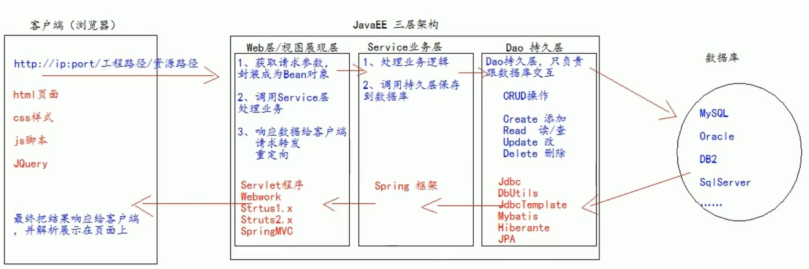
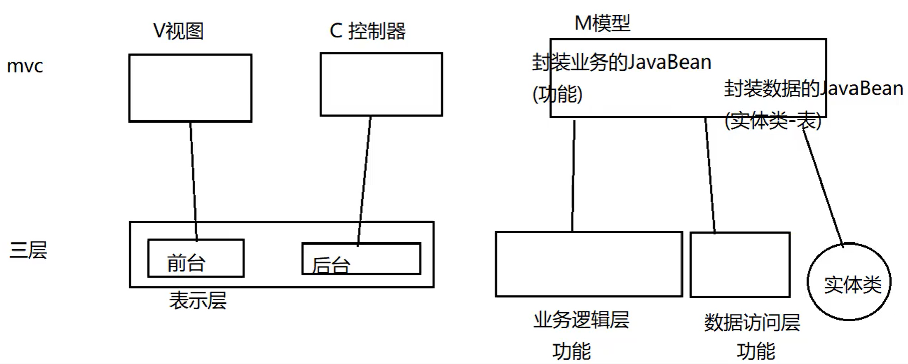

### 1. 三层架构

- USL：view视图层
  - 前台代码：html、css、js等
  - 后台代码：servlet等
- BLL：service业务层
- DAL：dao持久层




- web
  - controller
- service
  - service
  - serviceIml
- dao
  - dao
  - daoImpl
- bean
  - pojo/entity/domain/bean
- 测试类
  - test/junit
- 工具类
  - utils


### 2. MVC

- m：model模型
  - 各个功能
  - JavaBean实现
    - 封装数据的JavaBean
    - 封装业务逻辑的JavaBean
- v：view视图
  - 页面展示、用户交互
  - html/js/css/jsp等前端技术实现
- c：controller控制器
  - 视图、模型的选择
  - jsp、servlet等实现


**三层架构与MVC：**

 


### 3. jsp页面

jsp页面作用：代替servlet回传html页面


jsp本质：servlet程序

- jsp编译后形成java类，此类继承了HttpJspBase

- HttpJspBase继承了Httpservlet，实现了HttpJspPage

  ```java
  public abstract class HttpJspBase extends Httpservlet imp1ements HttpJspPage
  ```

  

### 4. listener

