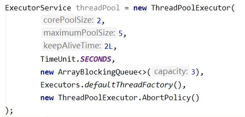

### 1. JUC

#### 1.1 JUC

java.util.concurrent

Java并发编程工具包


#### 1.2 进程和线程

##### 1.2.1 线程状态

- new 新建
- runnable 就绪
- blocked 阻塞
- waiting 不见不散
- timed_waiting 过时不候
- terminated 终结


##### 1.2.2 wait和sleep方法

- wait 
  - object类方法
  - 会释放锁
- sleep 
  - Thread类方法
  - 不占用锁 不释放锁


都可以被interrupted中断

从哪儿睡就从哪儿醒


##### 1.2.3 管程

即monitor 监视器

jvm同步使用管程对象实现


##### 1.2.4 用户线程和守护线程

- 用户线程：
  - 自定义线程
  - 主线程结束，有用户线程，jvm运行
- 守护线程：
  - 运行在后台的特殊线程，如垃圾回收
  - 主线程结束，没有用户线程，只有守护线程，jvm结束


### 2. Lock接口

#### 2.1 Synchronized关键字

**修饰范围：**

- 代码块：同步语句块
- 方法：同步方法
- 静态方法
- 类


#### 2.2 Lock接口

实现类：

- ReentrantLock可重入锁
  - lock()方法上锁
  - unlock()方法解锁，一般此方法写在finally代码块中（即使发生异常也会被调用，不会出现死锁现象


lock和synchronizedList对比

- synchronizedList是java关键字，自动实现锁
- lock是一个类，通过这个类手动实现锁


#### ~~2.3 创建线程的三种方式~~

- ~~继承Thread类~~
- ~~新建Thread类，实现Runable接口~~
- ~~使用Callable接口~~
- ~~使用线程池~~


### 3. 线程间通信

- synchronizedList
  - wait()方法
    - wait()中可能存在中断后虚假唤醒问题，故应该用while实现条件判断
  - notify()/notifyAll()方法
- lock
  - condition.await()方法
  - signal()/signalAll()方法


### 4. 线程间定制化通信

- 增加标志位并唤醒特定线程，确定线程间通信顺序


### 5. 集合的线程安全

ArrayList是线程不安全的

#### 5.1 ArrayList集合

##### 5.1.1 Vector类

层次：

- Object
  - AbstractCollection
    - AbstractList
      - Vector


add中添加了synchronizedList关键字


##### 5.1.2 Collections类

- Collections.synchronizedList(new ArrayList())方法，为新创的类加锁


##### 5.1.3 CopyOnWriteArrayList类

写时复制技术

- 读时支持并发读
- 写时要求独立写（用lock上锁）
  - 写的时候先将原数组复制一份，然后向复制后数组的写入
  - 写完之后和原数组合并


#### 5.2 HashSet集合

##### 5.2.1 CopyOnWriteArraySet类

同样使用写时复制技术


#### 5.3 HashMap集合

#####  5.3.1 ConcurrentHashMap类


### 6. 多线程锁

当有多个方法都加上了锁时


#### 6.1 synchronized作用范围

当有多个方法都加上了synchronized锁时：

- 当用在实例方法上时，synchronized锁住的是当前对象
- 当用在静态方法上时，synchronized锁住的是当前类Class（字节码)
  - 此时只要是这个类的对象，无论是否为同一对象都会同步阻塞
- 当用在方法块上时，synchronized锁住的是括号内的对象/类


#### 6.2 公平锁和非公平锁

ReentrantLock通过队列可实现

- 非公平锁NonFairSync：
  - 实现：发现没人抢占锁时，直接尝试获取锁，不去检查队列
  - 可能造成线程被饿死的情况
  - 执行效率高
- 公平锁FairSync：
  - 实现：发现没人抢占锁时，先判断队列中是否有等待的节点，如果有的话就排队，如果没有的话就尝试获取锁
  - 不会有线程被饿死的情况
  - 效率相对较低


#### 6.3 可重入锁

可重入锁也可叫做递归锁


synchronized和lock都是可重入锁

- synchronized隐式可重入锁
  - 隐式：即上锁解锁自动完成
  - 可重入锁：当多层锁都为同一个锁时，拿到最外层的锁，就可以自由进入内层锁的区域而不会因为所被占用而被阻塞
- lock显示可重入锁：手动上锁解锁


#### 6.4 死锁

- 死锁：两个或两个以上的进程，在执行过程中因为资源抢夺而造成互相等待的现象即死锁
- 验证死锁：
  - jps：查看当前运行的进程
  - jstack + 进程号：跟踪堆栈信息，jvm中自带堆栈跟踪工具


### 7. Callable接口

#### 7.1 创建线程的方式

- 继承Thread类

- 实现Runable接口，重写run()方法

  > 以上方法在线程终止时，即run()完成时，无法使线程返回结果

- 实现Callable接口，重写call()方法

- 线程池

  > 以上方法在jdk1.5以后实现


#### 7.2 Runable和Callable接口比较

实现方法名称不同：

- call()方法：Callable有返回值，如果无法计算结果则会抛出异常
- run()方法：Runable没有返回值，且不会抛出异常


#### 7.3 Callable方式实现线程创建

##### 7.3.1 Thread

Thread()满足：

- new Thread(Thread)
- new Thread(Runable)


即Thread()中不能直接加入实现Callable接口的类的实例对象，需要通过FutureTask类中转

FutureTask实现Runable接口，构造方法中传入Callable参数


##### 7.3.2 FutureTask类

特点：

- 即不影响主线程的事件，为额外事件新开线程
- get()方法：最终再汇总，且只需要汇总一次


### 8. JUC的辅助类

#### 8.1 CountDownLatch类

减少计数：

- 构造方法：设置初始值
- countDown()方法：实现每次减一
- await()方法：若不等于0则当前线程一直阻塞；当计数器的值为0时，则唤醒当前线程继续执行


#### 8.2 CyclicBarrier类

循环栅栏：

- 构造方法：设置目标障碍数和Runable接口实现类实例（即固定值到达之后执行的方法）
- CyclicBarrier
- await()方法：允许一组线程互相等待，在一组线程（线程数=目标障碍数）中的最后一个线程到达之后执行一次Runable接口实现类实例中的run()方法


#### 8.3 Semaphore类

计数的信号量：

- 构造方法：许可数
- accquire()：获取到一个许可，其他线程等待此许可
- realese()：释放一个许可，被阻塞的线程会被唤醒
  - 许可==资源信号量


### 9. ReentrantReadWriteLock读写锁

#### 9.1 乐观锁与悲观锁

- 悲观锁
  - 每个人操作前加锁，操作后解锁
  - 能解决并发问题
  - 不能实现并行，只能一个一个操作进行
- 乐观锁
  - 每个人操作前获得版本号，操作后先比较版本号跟数据库版本号是否一致
    - 如果一致则修改版本号并存到数据库
    - 如果不一致则提交失败
  - 支持并发操作


#### 9.2 表锁与行锁

- 表锁：对整张表上锁
- 行锁：对某一行上锁


#### 9.3 读写锁

- ReentrantReadWriteLock.ReadLock().lock()：读锁，共享锁，可能发生死锁

   

- ReentrantReadWriteLock.WriteLock().lock()：写锁，独占锁，可能发生死锁

   


#### 9.4 读写锁的降级

- 降级：即写锁降级为读锁
  - 获取写锁-获取读锁-是否写锁-释放读锁
  - 为了提高数据的可见性


读锁不能升级为写锁


### 10. BlockingQueue阻塞队列

#### 10.1 阻塞队列分类

- ArrayBlockingQueue：基于数组的阻塞队列，维护了定长的数组
- LinkedBlockingQueue：基于链表的阻塞队列，默认大小为Integer.MAX_VALUE
- DelayQueue：使用优先级实现的延迟的无界阻塞队列（延迟时间到了才能从队列中获取到该元素
- PrioirityBlockingQueue：支持优先级排序的无界队列
- SynchronousQueue：单个元素的队列
- LinkedTransferQueue：由链表组成的无界阻塞队列
- LinkedBlockingDeque：由链表组成的双向阻塞队列


#### 11.2 阻塞队列方法

 


#### 11.3 实例


### 11.ThreadPool 线程池

#### 11.1 线程池架构

 


#### 11.2 线程池使用方式

**线程池创建：**

- Executors.newFixedThreadPool(int)：
  - 创建有n个线程的线程池
  - 线程可以被重复使用
  - 线程被提交的数量超过n，需在队列中等待
- Executors.newSingleThreadExecutor()
  - 创建有一个线程的线程池
- Executors.newCachedThreadPool()
  - 线程池根据需求创建线程，可扩容


**线程使用：**

- .execute(Runable)
- .shutdown()


#### 11.3 ThreadPoolExecutor

以上方式的底层原理都是创建了ThreadPoolExecutor类


##### 11.3.1 ThreadPoolExecutor参数

- corePoolSize：核心线程数/常驻线程数

- maximumPoolSize：最大线程数

- keepAliveTime：值

- TimeUnit：单位

  > 线程存活时间，即线程多长时间不用就直接把线程结束

- workQueue：阻塞队列，存放等待线程的请求

- ThreadFactory：线程工厂，用于创建线程

- RejectedExecutionHandler：拒绝策略


##### 11.3.2 工作流程

- 主线程执行execute()方法，具体线程被创建
- 当线程数超过corePool，接下来的请求被放入阻塞队列进行等待
- 当等待数超过阻塞队列大小时，为新的请求创建线程
- 当线程数超过maximumPoolSize，会执行handler拒绝策略

 


##### 11.3.3 拒绝策略

- AbortPolicy：默认策略，直接抛出异常阻止系统正常运行
- CallerRunsPolicy：调用者模式，该策略既不会抛弃任务也不会抛出异常，而是将某些任务回退到调用者，降低新任务的流量
- DiscardOldestPolicy：抛弃队列中等待最久的任务，然后把当前任务加人队列中尝试再次提交当前任务
- DiscardPolicy：丢弃无法处理的任务，不予任何处理也不抛出异常。如果允许任务丢失，这是最好的一种策略


#### 11.4 自定义线程池

 


### 12. Fork/Join分支合并框架

将一个大的任务拆分成多个子任务进行并行处理，最后将子任务结果合并成最后的计算结果,并进行输出


#### 12.1 框架组成

- 分支合并池

   

- 分支合并类

   


#### 12.2 实例

```java
//Fork/Join分支合并框架
public class forkJoinDemo {

	public static void main(String[] args) throws Exception, Exception {
		MyTask task = new MyTask(1, 100);
		//创建分支合并池对象
		ForkJoinPool forkJoinPool = new ForkJoinPool();
		ForkJoinTask<Integer> forkJoinTask = forkJoinPool.submit(task);
		Integer res = forkJoinTask.get();
		System.out.println(res);
		//关闭池对象
		forkJoinPool.shutdown();
	}

}

class MyTask extends RecursiveTask<Integer> {
	private static final int VALUE = 10;
	private int begin;
	private int end;
	private int result;
	
	public MyTask(int begin, int end) {
		this.begin = begin;
		this.end = end;
		this.result = 0;
	}

	@Override
	protected Integer compute() {
		if (end - begin <= VALUE) {
			for (int i = begin; i <= end; i++) {
				result += i;
			}
		}
		else {
			int mid = (this.begin + this.end) / 2;
			MyTask task1 = new MyTask(begin, mid);
			MyTask task2 = new MyTask(mid + 1, end);
			task1.fork();
			task2.fork();
			result = task1.join() + task2.join();
		}
		return result;
	}
	
}
```


### 13. CompletableFuture异步回调

  

实例：

```java
public static void main(String[] args) throws InterruptedException, ExecutionException {
		//没有返回值
		CompletableFuture<Void> completableFuture1 = CompletableFuture.runAsync(()->{
			System.out.println("hello");
		});
		
		completableFuture1.get();
		
		//有返回值
		CompletableFuture<Integer> completableFuture2 = CompletableFuture.supplyAsync(()->{
			System.out.println("hi");
			return 1;
		});
		
		completableFuture2.whenComplete((u,t)-> {
			System.out.println(u);
			System.out.println(t);
		}).get();
	}
```

