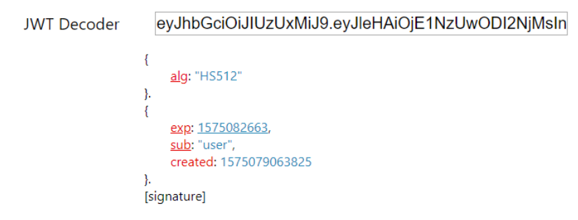
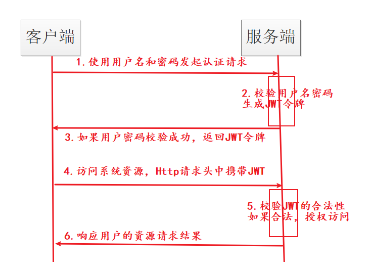
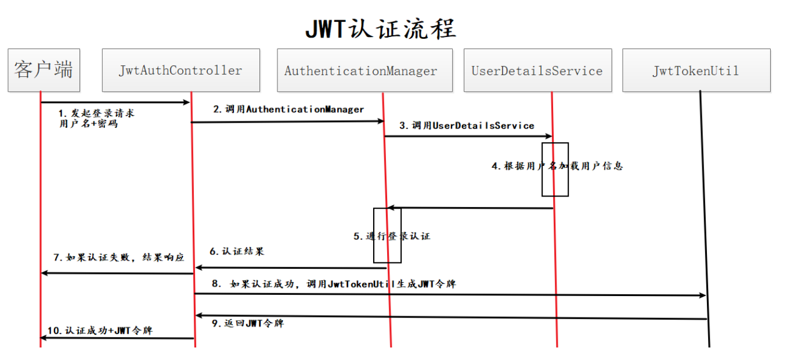
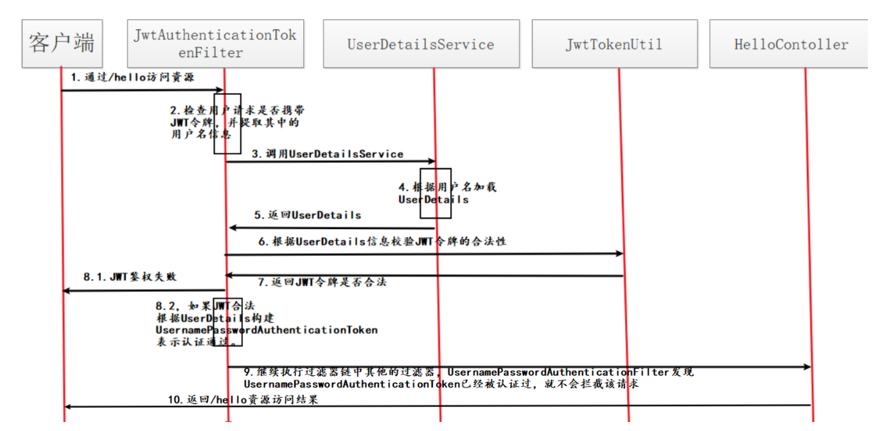

颁发令牌表示此用户已登录，而不是校验其用户名密码

### 1. JWT令牌结构

- jwt header：说明jwt使用什么算法进行签名/解签

- pay load：携带自定义状态

  - 过期时间
  - 用户名
  - 令牌创建时间

- signature：对前两部分进行签名，防止前两部分被篡改

  > 签名：用存在服务端的密钥对前两部分进行签名，也只有服务端可以解签

以上部分再由base64编码得：

 

### 2. JWT流程

 

#### 2.1 认证流程

 

#### 2.2 鉴权流程

 
