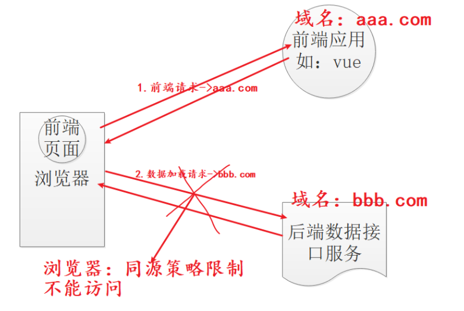

颁发令牌表示此用户已登录，而不是校验其用户名密码

### 1. JWT令牌结构

- jwt header：说明jwt使用什么算法进行签名/解签

- pay load：携带自定义状态

  - 过期时间
  - 用户名
  - 令牌创建时间

- signature：对前两部分进行签名，防止前两部分被篡改

  > 签名：用存在服务端的密钥对前两部分进行签名，也只有服务端可以解签

以上部分再由base64编码得：

 

### 2. JWT流程

 

#### 2.1 认证流程

 

#### 2.2 鉴权流程

 

### 3. 跨域问题

#### 3.1 跨域问题概述

##### 3.1.1 浏览器同源策略

- 域：一个站点，由protocal、host和port三部分组成
  - host：可以是域名，也可以是ip
  - port如果没有指明，则是使用protocal的默认端口
- 资源：一个URL对应的内容，可以是一张图片、一种字体、一段HTML代码、一份JSON数据等等任何形式的任何内容
- 同源策略：为了防止XSS，浏览器、客户端应该仅请求与当前页面来自同一个域的资源，请求其他域的资源需要通过验证。

##### 3.1.2 跨域问题

浏览器同源策略限制访问

 

#### 3.2 跨域解决

##### 3.2.1 代理解决

浏览器从代理看前端和后端，处在同一个域中

##### 3.2.2 后端跨站访问配置CORS

**原理：**

浏览器到后端服务器做预检，预检通过即可打破同源策略访问

**过程：**

1. 当浏览器向服务端发送预检请求时，服务端在请求头中加入字段，表示可以打破同源策略：
   - Access-Control-Allow-Origin：允许哪些ip或域名可以跨域访问，即打破同源策略。如果没有这个header，服务器将不会进行CORS验证
   - Access-Control-Request-Headers：为实际请求将会使用的header集合
     - Access-Control-Max-Age：表示在多少秒之内不需要重复校验该请求的跨域访问权限
     - Access-Control-Allow-Methods：表示允许跨域请求的HTTP方法
     - Access-Control-Allow-Headers：表示访问请求中允许携带哪些Header信息，如
       - Accept
       - Accept-Language
       - Content-Language
       - Content-Type

2. 浏览器再次向服务器发送真正的请求，请求数据

**配置：**

- 局部实现：
  - 直接设置resp响应头
  - @CrossOrigin注解
- 全局实现：
  - filter实现，配置请求头
  - 重写WebMvcConfigurer的addCorsMappings方法
  - 注入CorsConfigurationSource，相当于注入一个filter

spring security中

- 在配置文件中先开启cors配置
- 以上配置都可以使用，官方建议最后一种

