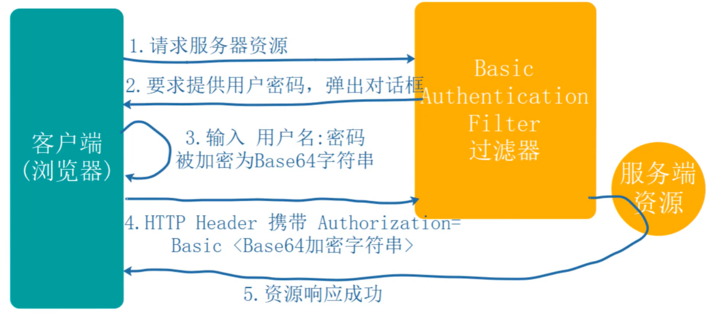

### 1. HttpBasic模式

#### 1.1 使用

- 新建SecurityConfig配置类，继承WebSecurityConfigurerAdapter

- 重写configure方法

  ```java
  @Override
  protected void configure(HttpSecurity http) throws Exception {
      http.httpBasic()//开启httpBasic认证
      .and()
      .authorizaRequests()
      .anyRequest()
      .authenticated();
  }
  ```

  

用户名密码配置在配置文件中


#### 1.2 原理

 


### 2. hash算法（继承体系

#### 2.1 PasswordEncoder接口

定义了hash算法的加密和匹配

- encode：抽象方法
- matches：抽象方法
- upgradeEncoding：非抽象方法


#### 2.2 BCryptPasswordEncoder实现类

实现了PasswordEncoder接口

- encode
  - gensalt
    - 拼接版本
    - 拼接轮数
    - 随机数生成盐
    - base64编码后拼接
  - hashpw
    - 根据版本和轮数，将密码生成hash值
    - base64编码后拼接


**密码组成部分（60位：**

- $2a：BCrypt算法版本
- $10：算法强度，即加密轮数
- $zt6dUMTjNSyzINTGyiAglu：随机生成的盐
- na3mPm7qdgl26vj4tFpsFO6WlK5lXNm：hash值


### 3. fromLogin模式

使用过滤器实现登陆认证，而不是用controller实现


#### 3.1 使用

- 登录认证逻辑
- 资源访问控制
- 用户角色权限

=》https://www.kancloud.cn/hanxt/springsecurity/2003508


### 4. 源码-过滤器链

