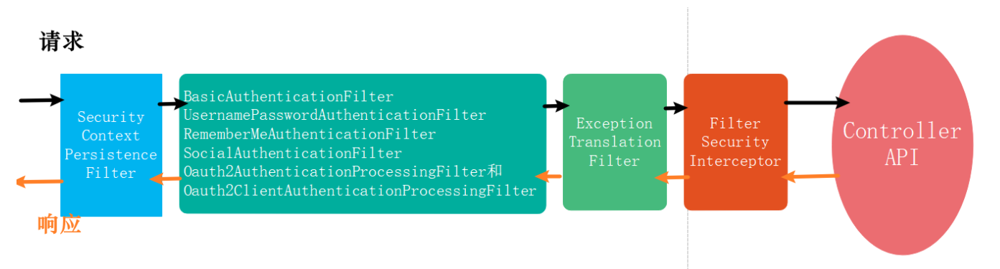
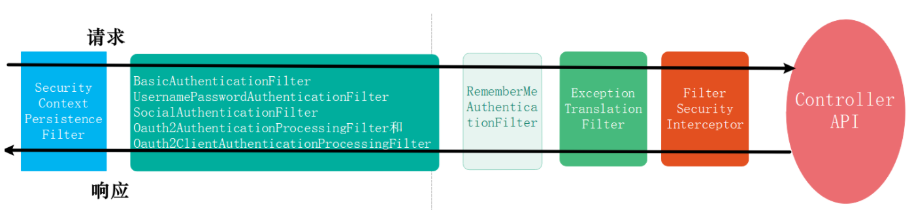

### 1. HttpBasic模式

#### 1.1 使用

- 新建SecurityConfig配置类，继承WebSecurityConfigurerAdapter

- 重写configure方法

  ```java
  @Override
  protected void configure(HttpSecurity http) throws Exception {
      http.httpBasic()//开启httpBasic认证
      .and()
      .authorizaRequests()
      .anyRequest()
      .authenticated();
  }
  ```

  

用户名密码配置在配置文件中


#### 1.2 原理

 


### 2. hash算法（继承体系

#### 2.1 PasswordEncoder接口

定义了hash算法的加密和匹配

- encode：抽象方法
- matches：抽象方法
- upgradeEncoding：非抽象方法


#### 2.2 BCryptPasswordEncoder实现类

实现了PasswordEncoder接口

- encode
  - gensalt
    - 拼接版本
    - 拼接轮数
    - 随机数生成盐
    - base64编码后拼接
  - hashpw
    - 根据版本和轮数，将密码生成hash值
    - base64编码后拼接


**密码组成部分（60位：**

- $2a：BCrypt算法版本
- $10：算法强度，即加密轮数
- $zt6dUMTjNSyzINTGyiAglu：随机生成的盐
- na3mPm7qdgl26vj4tFpsFO6WlK5lXNm：hash值


### 3. fromLogin模式

使用过滤器实现登陆认证，而不是用controller实现


#### 3.1 使用

- 登录认证逻辑
- 资源访问控制
- 用户角色权限

=》https://www.kancloud.cn/hanxt/springsecurity/2003508


### 4. 源码-过滤器链

 


### 5. session会话管理

#### 5.1 创建使用session的方法

Spring Security提供4种方式精确的控制会话的创建：

- **always**：如果当前请求没有对应的session存在，Spring Security创建一个session。
- **ifRequired（默认）**： Spring Security在需要使用到session时才创建session
- **never**： Spring Security将永远不会主动创建session，但是如果session在当前应用中已经存在，它将使用该session
- **stateless**：Spring Security不会创建或使用任何session。适合于接口型的无状态应用（前后端分离无状态应用），这种方式节省内存资源

```java
@Override
protected void configure(HttpSecurity http) throws Exception {
    http.sessionManagement()
        .sessionCreationPolicy(
                SessionCreationPolicy.IF_REQUIRED
        )
}
```

重要的是：该配置只能控制Spring Security如何创建与使用session，而不是控制整个应用程序。如果我们不明确指定，Spring Security可能不会创建session，但是我们的应用程序可能会创建session（一般spring应用的session管理交由Spring Session进行）！

#### 5.2 会话超时管理

##### 5.2.1 session会话超时时间配置

两种设置会话超时时间的方式

- server.servlet.session.timeout=15m
- spring.session.timeout = 15m

第二种方式的优先级更高。

> 注意：在Spring Boot中Session超时最短的时间是一分钟，当你的设置小于一分钟的时候，默认为一分钟。


##### 5.2.2 会话超时处理

会话超时之后，我们通常希望应用跳转到一个指定的URL，显示会话超时信息。可以使用如下的配置的代码实现。

```
    http.sessionManagement()
          .invalidSessionUrl("/invalidSession.html");    //非法超时session跳转页面
```

> 以上路径需要配置permitAll()权限，即无需授权即可访问。


#### 5.3 会话固化保护

session-fixation-protection 即session的固化保护功能，该功能的目的是一定程度上防止非法用户窃取用户session及cookies信息，进而模拟session的行为。

```java
    http.sessionManagement()
        .sessionFixation().migrateSession()
```

选项：

- 设置为“*none*”时，原始会话不会无效
- 设置“*newSession*”后，将创建一个干净的会话，而不会复制旧会话中的任何属性
- `migrateSession` - 即对于同一个cookies的SESSIONID用户，每次登录访问之后访问将创建一个新的HTTP Session会话，旧的HTTP Session会话将无效，并且旧Session会话的属性将被复制。**在Servlet 3.0及其之前的版本，这种方式是默认的**
- `changeSessionId` - 这种方式不会创建新的session，作为替代，使用Servlet 容器(`HttpServletRequest#changeSessionId()`)提供的会话固化保护功能 。**这个选项在Servlet 3.1 (Java EE 7) 或者更新版本的web容器下默认生效。** 每次登录访问之后都更换sessionid，但是没有新建session会话。


#### 5.4 Cookie的安全

通过配置方式来提高session的安全性：

```xml-dtd
server.servlet.session.cookie.http-only=true
server.servlet.session.cookie.secure=true
```

- httpOnly：如果为true，则浏览器脚本将无法访问cookie
- secure：如果为true，则仅通过HTTPS连接发送cookie，HTTP无法携带cookie。


### 6. 多端登陆

- 更改配置

  ```java
  .sessionManagement()
      .maximumSessions(1)
      .maxSessionsPreventsLogin(false)
      .expiredSessionStrategy(new CustomExpiredSessionStrategy())
  ```

  - maximumSessions表示同一个用户最大的登录数量
  - maxSessionsPreventsLogin提供两种session保护策略：
    - true表示已经登录就不予许再次登录，
    - false表示允许再次登录但是之前的登录账户会被踢下线
  - expiredSessionStrategy表示自定义一个session被下线(超时)之后的处理策略。

- 实现处理策略类

  - 实现SessionInformationExpiredStrategy接口
  - 实现onExpiredSessionDetected方法 


### 7. RBAC+Spring Security

#### 7.1 自定义登陆结果处理

重写successHandler和failureHandler


#### 7.2 登陆认证+动态加载用户角色权限

- 实现UserDetails类

- 实现UserDetailsService类

- 更改配置

  ```java
  @Override
      public void configure(AuthenticationManagerBuilder auth) throws Exception {w
          auth.userDetailsService(myUserDetailsService) //数据库动态角色权限信息加载
                  .passwordEncoder(passwordEncoder());
      }
  ```


#### 7.3 动态加载资源鉴权规则

- 更改配置

  ```java
  .authorizeRequests()
      .anyRequest().access("@rabcService.hasPermission(request,authentication)")
  ```

- 实现拦截每一个请求的方法：从动态加载用户角色权限中判断是否能够访问


### 8. rememberMe功能

#### 8.1 配置

```java
@Configuration
public class SecurityConfig extends WebSecurityConfigurerAdapter {
    @Override
    protected void configure(HttpSecurity http) throws Exception {
        http.rememberMe();   //实现记住我自动登录配置，核心的代码只有这一行
    }
}
```


#### 8.2 原理

##### 8.2.1 RememberMeToken

cookie中的字段，用来实现记住我功能

- username：用户名
- expiryTime：过期时间
- signatureValue的Base64加密
  signatureValue = MD5(username+expirationTime+password+serise)


##### 8.2.2 过滤器链

 


#### 8.3 持久化处理

即把cookie的值在后端存入数据库中 而不是仅在后端内存中


- 初始化一个PersistentTokenRepository类型的Spring bean，并将系统使用的DataSource注入到该bean中

  ```java
  @Autowired
  private DataSource dataSource;
  
   @Bean
   public PersistentTokenRepository persistentTokenRepository(){
       JdbcTokenRepositoryImpl tokenRepository = new JdbcTokenRepositoryImpl();
       tokenRepository.setDataSource(dataSource);
       return tokenRepository;
   }
  ```

- 增加配置

  ```java
  .rememberMe()
      .tokenRepository(persistentTokenRepository())
  ```

  

