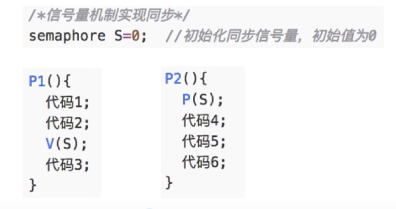
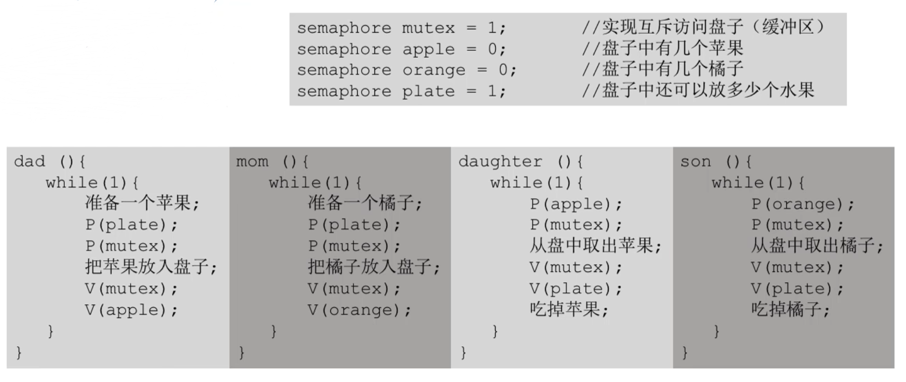
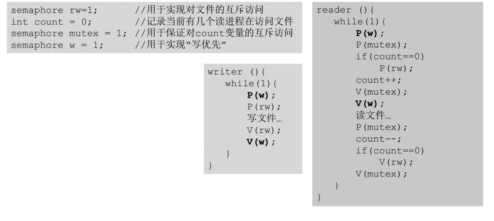

## 一、引论

### 1. 计算机系统组成

- 应用程序
- 操作系统
- 硬件

### 2. 操作系统作用

- 为硬件提供资源管理功能
  - 处理机管理
  - 存储器管理
  - 文件管理
  - 设备管理
- 为应用程序提供接口
  - 用户接口
    - 命令接口
    
      > 用户直接使用
    
      - 联机命令接口（交互式）：一句一句的输入和执行
      - 脱机命令接口（批处理）：一段一段的输入和执行
    
    - 程序接口：由一组系统调用组成
    
      > 程序调用，程序直接使用
  - 图形用户界面
  
- 对硬件机器实现拓展

### 3. 操作系统特征

- 并发：

  > 并行：一个时刻可以同时运行多个任务
  >
  > 串行：一个时刻只运行一个任务
  >
  > 并发：宏观上并行，微观上串行 
  >
  > 
  >
  > 单核cpu是串行的，多核CPU可以同时运行的进程数和核数相等

- 共享：系统中的资源可以供多个并发执行的进程共同使用

  - 互斥共享：一个时间段，资源只允许一个进程使用
  - 同时共享：一个**时间段**，资源允许多个进程使用（并发/并行都可能发生，如文件传输/听歌和打游戏）

- 虚拟：

  - 空分复用技术
  - 时分复用技术

- 异步：

### 4. 操作系统发展（b

- 主机完全控制输入输出
- 单道批处理系统
- 多道批处理系统
- 分时系统
- 实时系统

### 5. 操作系统运行机制

#### 5.1 指令

指令：操作系统能识别并执行的最基本的命令

分类：

- 特权指令
- 非特权指令

#### 5.2 处理器状态

- 用户态：CPU只能执行非特权指令
- 核心态：执行特权/非特权指令

用程序状态字寄存器的标志位来标识当前处理机的状态

**转换：**

- 用户态转换到核心态的切换由且只能由中断完成
- 核心态转换为用户态 通过更改程序状态字标志位完成

#### 5.3 程序分类

- 内核程序：运行在核心态，实现**操作系统内核**功能的程序即为内核程序

  > 操作系统内核：运行在操作系统最底层
  >
  > - 时钟管理
  > - 中断处理
  > - 原语
  > - 对系统资源进行管理的功能
  >   - 进程管理
  >   - 存储器管理
  >   - I/O设备管理等
  >
  >  
  >
  > 操作系统体系结构：
  >
  > - 大内核：四个部分都包括
  >
  > - 微内核：只包括前三个部分
  >
  > 

- 应用程序：运行在用户态

### 6. 中断和异常

中断机制诞生于实现多道程序并发运行

本质：发生中断就意味着操作系统要介入，开展管理工作

#### 6.1 中断过程

- 进程向CPU发出中断信号
  - 计时部件发出中断信号
  - 进程发出系统调用（内中断信号）
  - I/O设备发出I/O完成的中断信号
- CPU切换到核心态，把CPU使用权限交给操作系统
- 操作系统内核对中断信号进行处理
  - 时间片用完，切换到下一个进程
  - 操作系统让I/O设备开始工作，并让当前进程暂停，切换到下一个进程
  - 操作系统让上一个进程恢复运行
- 操作系统把CPU使用权限交还给用户进程，另一个进程开始执行

#### 6.2 中断分类

##### 6.2.1 内中断/异常

中断信号的来源为CPU内部，与当前执行的指令有关

分类：

- 自愿/指令中断：如系统调用等
- 强迫中断：
  - 硬件故障：如缺页
  - 软件中断：如整数/0

##### 6.2.2 外中断

中断信号的来源为CPU外部，与当前执行的指令无关

分类：

- 外设请求：如I/O设备完成操作
- 人工干预：如用户强制终止一个进程

### 7. 系统调用

应用程序通过系统调用来请求操作系统的服务

> 防止应用程序可以随意使用系统资源而造成问题

**系统调用和库函数的区别：**

应用程序通过调用库函数 从而完成系统调用

- 库函数相当于是对系统调用的一个封装，但不是所有库函数都进行了系统调用，如读取一个值的绝对值
- 库函数屏蔽掉了系统调用的一些具体细节
- 而系统调用又屏蔽了硬件操作的细节

 

**系统调用发生过程：**

以程序为例，翻译成机器码后：

- 用户态下：
  - 把参数装入寄存器
  - 发出中断（即系统调用）
- 核心态：
  - 操作系统内核处理中断

即发出系统调用为用户态，处理系统调用为核心态

## 二、进程与线程

### 1. 进程

#### 1.1 进程定义

进程的引出：为了实现多个程序并发执行

#### 1.2 进程的组成

单个进程

- PCB：操作系统用于管理进程的信息，是进程存在的唯一标识
  - 进程描述信息
    - 进程标识符PID
      - 进程创建时 os分配
      - 用来标识进程是独一无二的
    - 用户标识符UID
  - 进程管理和控制信息
  - 资源分配清单
  - 处理机相关信息
- 程序段：存放程序代码
- 数据段：程序运行时使用、产生的运算数据

#### 1.3 进程的组织

多个进程

- 链接方式：按照进程状态分为多个队列
  - 操作系统指针：
    - 执行指针
    - 就绪队列指针
    - 阻塞队列指针
- 索引方式：根据进程状态不同，建立多张索引表，索引表项中存放的是PCB的地址
  - 操作系统指针：
    - 执行指针
    - 就绪表指针
    - 阻塞表指针

#### 1.4 进程特征

- 动态性
- 并发性
- 独立性：进程是资源分配，接受调度的基本单位 
- 异步性：可能会导致执行结果的不确定性
- 结构性

#### 1.5 进程状态

**五种状态：**

- 运行态：占用CPU资源，正在运行的进程
- 就绪态：已经具备运行条件，但CPU未空闲（拥有除处理机外所有的资源，一旦获得处理机，该进程就可以开始执行
- 阻塞态：等待某个事件发生

- 创建态：进程正在被创建，正在被分配资源、初始化等
- 终止态：进程正在撤销，操作系统会回收资源等

**进程状态的转换：**

  

#### 1.6 进程控制

使用原语实现进程控制->进程控制为原子操作

- 原语：关中断+开中断

原语框架：

- 更新PCB信息
- 将PCB放入队列
- 分配/回收资源

##### 1.6.1 进程控制相关的原语

- 进程创建（无->创建态->就绪态
  - 创建原语：
    - 申请空白PCB
    - 为进程分配资源
    - 初始化PCB
    - 将PCB加入就绪队列
  - 引起进程创建的事件：
    - 用户登陆
    - 作业调度
    - 提供服务
    - 应用请求
- 进程终止（就绪态/运行态/阻塞态->终止态
  - 撤销原语：
    - 找到要终止进程的PCB
    - 若进程正在执行，则剥夺CPU，将CPU分配给其他进程
    - 终止其所有子进程
    - 将该进程拥有的资源还给操作系统或者其父进程
    - 删除PCB
  - 引起进程终止的事件：
    - 正常结束（运行态
    - 异常结束（运行态
    - 外界干预（将就绪态/阻塞态的进程终止

- 进程阻塞（运行态->阻塞态
  - 阻塞原语：
    - 找到要阻塞进程的PCB
    - 保护进程运行线程，改变PCB状态信息，暂时停止CPU运行
    - 将PCB插入相应事件的阻塞队列
  - 引起进程阻塞的事件：
    - 等待系统分配某种资源
    - 等待合作的其他进程完成工作
- 进程唤醒（阻塞态->就绪态
  - 唤醒原语：
    - 找到要唤醒进程的PCB
    - 将PCB从阻塞队列移除，改变PCB状态信息
    - 将PCB加入到就绪队列
  - 引起进程唤醒的事件：
    - 等待事件发生了

- 进程切换（运行态->阻塞态/就绪态；就绪态->运行态
  - 切换原语：
    - 将运行环境存入PCB
    - 将PCB移入相应队列
    - 选择另一个进程执行，更新新进程PCB
    - 根据PCB恢复新进程运行环境
  - 引起进程切换的事件：
    - 当前进程时间片到
    - 有优先级更高的进程到达
    - 当前进程主动阻塞
    - 当前进程终止

#### 1.7 进程通信

即进程间的信息通信

##### 1.7.1 共享存储

多对多

操作系统分配一个共享空间，进程对共享空间的访问是互斥的

- 基于数据结构：如数组等
- 基于存储区：数据的形式、在存储区中的存储位置等都由进程自己协商决定

##### 1.7.2 管道通信

多对一

即在内存空间中开辟的一个大小固定的缓冲区，一般和一个页面大小一致

- 管道采用半双工通信，可以设置两个管道完成双向同时通信
- 进程对管道的访问是互斥的

通信流程：

- 进程A往管道中写数据，调用**write()系统调用**，以字符流的形式写入
- 当管道中数据写满之后，**write()系统调用**被阻塞，进程B才能从管道中读数据，调用**read()系统调用**
- 当管道中全部数据被读出时，**read()系统调用**被阻塞进程A才能写数据

管道中数据一旦被读出，就从管道中被抛弃，故一个管道的读进程只能有一个

##### 1.7.3 消息传递

多对多/一对一

传递的数据为**格式化的消息**，通过原语实现数据交换：发送消息/接收消息

- 消息头
- 消息体

消息传递的两种方式

- 直接通信方式：消息直接挂到接收进程的消息缓冲队列上
- 间接通信方式：消息要先发到信箱上
  - 信箱为操作系统为所有进程维护的交换信息的一个方式
    - 不同的进程都可以把要和其它进程通信的消息发到信箱
    - 要取消息时使用接收原语从信箱中取出

### 2. 线程

#### 2.1 进程定义

增加线程的并发度，即在进程中也实现并发功能

进程：资源分配的基本单位

线程：调度的基本单位

#### 2.2 线程的实现方式

- 用户级线程：从用户视角看到的线程
  - 由应用程序通过线程库实现
  - 所有的线程管理工作都由应用程序负责（包括线程切换
- 内核级线程：从操作系统内核视角能看到的线程
  - 线程管理工作由操作系统内核完成
  - 在核心态下完成
  - **只有内核级线程才是处理机调度的基本单位**

#### 2.3 多线程模型

- 多对一模型：
  - 多个用户级线程映射到一个内核级线程
  - 每个用户进程只对应一个内核级线程
- 一对一模型：即纯粹的内核级线程
  - 一个用户及线程映射到一个内
    核级线程
  - 每个用户进程有与用户级线程同
    数量的内核级线程
- 多对多模型：
  - n用户及线程映射到m个内核级线程(n>=m)
  - 每个用户进程对应m个内核级线程

## 三、处理机调度

即实现并发的功能

### 1. 三个层次

#### 1.1 高级调度

即作业调度

作业->创建态->就绪态

**过程：**

- 按一定的原则从外存上处于后备队列的作业中挑选一个或多个作业
- 分配内存等必要资源，并建立相应的进程(建立PCB)，以获得竞争处理机的权利

#### 1.2 中级调度

即内存调度

挂起就绪态/挂起阻塞态->就绪态/阻塞态

暂时不能运行的进程会调到外存等待（挂起状态）。等其重新具备了运行条件 内存有空闲时，再重新调入内存

PCB一直存在内存中的挂起队列中，不会被调出内存

**过程：**

- 按一定的原则将挂起态的就绪进程调回内存

> 七状态模型：
>
>  

#### 1.3 低级调度

即进程调度

就绪态->运行态

**过程：**

- 按一定的原则将某个进程从就绪态变为运行态

### 2. 进程调度

#### 2.1 进程调度的时机

**可以发生进程调度的时机：**

- 当前运行的进程主动放弃处理机
  - 进程正常终止
  - 进程异常终止
  - 进程主动请求阻塞，如等待I/O等

- 当前运行的进程被动放弃处理机
  - 时间片用完
  - 更紧急的事情要处理，如I/O中断
  - 优先级更高的进程进入就绪队列

**不能发生进程调度的时机：**

- 处理中断时（与硬件密切相关

- 进程在**操作系统内核程序临界区**中

  - 临界资源：互斥访问的资源，一次只允许一个进程使用

  - **临界区**：访问临界资源的那段代码

    > 普通的临界区访问允许进程调度

  - **内核程序临界区**：一般是用来访问某种内核数据结构的，如进程的就绪队列

    - 进程在处于内核程序临界区前，会将临界资源上锁，如果上锁的时就绪队列，那么进程调度将无法正常进行

- 原子操作时（如1.6进程控制中的原语

#### 2.2 进程调度的方式

##### 2.2.1 非剥夺调度方式

即非抢占式，不允许被动放弃处理机

只适合早期的批处理系统

##### 2.2.2 剥夺调度方式

即抢占式，允许被动放弃处理机

适合于分时操作系统，实时操作系统

#### 2.3 进程调度的过程

- 选择一个进程
- 进程切换
  - 保存当前进程的各种数据
  - 恢复新进程的各种数据

### 3. 调度算法

#### 3.1 调度算法评价指标

- CPU利用率：CPU忙碌时间/总时间
- 系统吞吐量：单位时间完成作业的数量 作业数/时间
- 周转
  - 周转时间：作业从提交到完成的时间 完成时间-提交时间
  - 平均周转时间：各作业周转时间和/作业数量
  - 带权周转时间：作业周转时间/作业实际运行时间
  - 平均带权周转时间：各作业带权周转时间和/作业数量
- 等待
  - 等待时间
    - 进程等待时间：建立进程后，等待被服务的时间之和
    - 作业等待时间：进程等待时间+在后备队列中等待的时间
  - 平均等待时间
- 响应时间：用户提交请求到首次产生响应的时间

#### 3.2 批处理系统调度算法

##### 3.2.1 FCFS

即先来先服务，按照到达的先后顺序依次进行调度

**特点：**

- 用于作业调度/进程调度

- 非抢占算法
- 不会导致饥饿

##### 2.4.3 SJF/SPF

即短作业/短进程优先，即最短的最先得到服务

**特点：**

- 用于作业调度SJF/进程调度SPF

- 非抢占算法

  > 抢占版本：**SRTN** 短剩余时间优先算法
  >
  > 
  >
  > 每当有进程进入时，都会检测是否当前运行的进程是否会被抢占（即比较谁的剩余时间更短

- 可能导致饥饿

##### 3.2.3 HRRN

即高响应比优先，每次调度时计算响应比，选择响应比最高的服务

- 响应比 = （等待时间 + 服务时间）/服务时间​

**特点：**

- 用于作业调度/进程调度
- 非抢占式算法
- 不会导致饥饿

#### 3.3 交互式系统调度算法

##### 3.3.1 时间片轮转RR

按照到达的顺序，轮流让各个进程执行一个时间片

**特点：**

- 用于进程调度
  - 时间片是指处理机的时间片
  - 只有作业放入内存变成进程后，才能被分配处理机时间片
- 抢占式算法（由时钟装置发出中断来通知CPU时间到
- 不会导致饥饿
- 常用于分时操作系统

时间片太大时，RR会退化为先来先服务算法

##### 3.3.2 优先级调度

加入了优先级

**特点：**

- 用于作业调度/进程调度
- 抢占/非抢占式算法

- 常用于实时系统
- 会导致饥饿问题

**优先级：**

- 静态/动态优先级
- 静态设计优先级原则：
  - 系统进程>用户进程
  - 前台进程>后台进程
  - I/O型进程>计算型进程
    - I/O设备和CPU可以并行工作
    - 如果优先让I/0繁忙型进程优先运行的话，则越有可能让I/O设备尽早地投入工作，尽早开始于CPU并行地工作
- 动态调整优先级
  - 等待时间过长 可以提升优先级（类似高响应比优先算法
  - 占用处理机时间过长 可以降低优先级

##### 3.3.3 多级反馈队列调度

**特点：**

- 用于进程调度
- 抢占式算法
- 可能发生饥饿

**流程：**

 

### 4. 进程同步与互斥

#### 4.1 进程同步

即进程间的直接制约关系，进程间为合作关系，需要协调进程的工作次序

#### 4.2 进程互斥

即进程间的间接制约关系，他们之间并没有直接的关系，是因为临界资源才产生的关系

##### 4.2.1 流程

- 进入区：检查是否可以进入临界区，如果可以进入则对邻接资源上锁
- 临界区：访问临界资源的代码
- 退出区：对临界资源解锁
- 剩余区：其他处理

##### 4.2.2 原则

- 空闲让进
- 忙则等待
- 有限等待（即不会发生饥饿
- 让权等待：即不能进入临界区时，应立即释放处理机，防止占着处理机等待

##### 4.2.3 软件实现

- 单标志法：

  - 每个进程在访问完临界区后，将临界区权限交给另一个进程，即每个进程使用临界区的权限只能被另一个进程赋予

     

  - 违背空闲让进原则

- 双标志先检查法

  - 用flag[]存储每个进程进入临界区的意愿。一个进程想进入临界区时，会先检查有没有其他进程的意愿为true，没有则将自己的意愿置为true

     

  - 进程切换时，可能造成两个进程同时被置为true，同时进入临界区，违背忙则等待原则

- 双标志后检查法

  - 即先将自己置为true，再检查是否有其他进程也为true

     

  - 进程切换时，可能导致两个进程都卡在第二步而不能进入临界区，违背了空闲让进和有限等待原则

- Peterson算法

  - 在双标志后检查法中改进：如果双方都想进入临界区，则可以主动让对方先使用临界区

     

  - 没有实现让权等待

##### 4.2.4 硬件实现

- 中断屏蔽方法：

  - 即某进程从开始访问临界区到结束访问临界区期间都不允许被中断

   

  - 不适用于多处理机（只对当前执行关中断的处理机有用，其他处理机上的进程还是可以访问临界区
  - 只能在核心态下才能使用，故只能用于内核态进程

- TestAndSet/TestAndSetLock指令：

  - 硬件实现，不允许被中断，只能一气呵成

      

  - 不满足让权等待

- swap指令

  - 硬件实现，不允许被中断，只能一气呵成

     

  - 不满足让权等待

#### 4.3 信号量机制

用户进程通过一对原语（wait/P;signal/V)对信号量（变量）进行操作

##### 4.3.1 信号量分类

- 整型信号量：
  - 表示系统中某种资源的数量
  
  - 类似双标志先检查法
  
  - 可能出现忙等，不满足让权等待
  
     
- 记录型信号量
  - 表示系统中某种资源的剩余数
  - 引入阻塞队列
    - p操作时 如果没有剩余资源会将自己阻塞
    - v操作时 如果有进程在此资源的阻塞态会唤醒一个进程
    
       

##### 4.3.2 信号量机制应用

- 进程互斥实现

  - 临界区=需要互斥访问的系统资源

     

- 进程同步实现 

   

- 进程前驱关系实现

   

##### 4.3.3 生产-消费者问题

- 互斥访问缓冲区

- 缓冲区没满时，生产者才能生产

- 缓冲区不为空时，消费者才能消费

   

 

问题：若互斥资源信号量的访问在外面，则会发生死锁的情况

##### 4.3.4 盘子一次只能放一个水果问题

- 互斥访问盘子

- 儿子只能拿橘子

- 女儿只能拿苹果

- 盘子是否为空

   

注：如果缓冲区资源只有一个，则mutex变量 可以省略

##### 4.3.5 吸烟者问题

- 互斥访问桌子

- 桌子上有组合n，第n个抽烟者才能取走东西

- 桌子是否为空

   

##### 4.3.6 读者-写者问题

- 读者和读者之间为同步关系

- 写者与其他都为互斥关系

   

- 改进：消除写进程饥饿的情况（读写公平法）

    

##### 4.3.7 哲学家进餐问题

- 两人互斥访问中间的筷子

增加限制：

- 最多四个人同时吃饭：设置初始值为4的同步信号量
- 奇数号先拿左边的筷子，偶数号先拿右边的筷子：先判断奇偶数
- 当两只筷子都可以拿起时才能使用：同一时间只能一个哲学家拿筷子

#### 4.4 管程

更高级的同步机制

##### 4.4.1 管程的特征

管程类似Java类：

- 实例变量
- 实例方法
- 构造函数
- 名字

管程特征：

- 实例变量内部只能由实例方法访问
- 且实例变量为私有的，外部必须定义get方法访问
- 每次仅允许一个进程在管程内执行某个实例方法

##### 4.4.2 解决生产消费者问题

由编译器来实现方法之间的互斥允许

 

### 5. 死锁

#### 5.1 死锁产生的必要条件

- 互斥条件：即抢夺互斥资源导致死锁
- 不可剥夺条件：即所获得的资源在未使用完之前，不能被剥夺，只能主动释放
- 请求和保持条件：进程保持了至少一个资源，又在请求其他资源
- 循环等待：即自己已获得的资源被其他进程请求，自己需要的资源被其他资源占有，形成进程资源的循环等待链

#### 5.2 死锁的处理策略

##### 5.2.1 预防死锁-静态策略

不允许死锁发生

破坏死锁产生的必要条件

- 破环互斥条件：即把互斥资源改为允许共享使用，如采用SPOOLing计数
- 破坏不剥夺条件：
  - 请求新资源不满足时，立即释放手上的所有资源
  - 请求新资源不满足时，由操作系统协助剥夺新资源

- 破坏请求和保持条件：采用静态分配方法，即进程在运行前，一次申请所需要的全部资源

  - 在资源未满足前，不运行
  - 一旦运行，这些资源就一直归它所有

- 破坏循环等待条件：采用顺序资源分配法，首先给系统中的资源编号，规定每个进程必须按编号递增的顺序请求资源，同类资源（即编号相同的资源）一次申请完

  - 只会出现拥有小编号等待大编号资源的场景

    

##### 5.2.2 避免死锁

不允许死锁发生

**银行家算法**：

- 在资源分配之前预先判断这次分配是否会导致系统进入不安全状态，即是否存在安全序列
  - 数据结构：
    - 最大需求数组
    - 已分配数组
    - 最多还需要
  - 算法：
    - 进程提出请求后，先检测是否超过最大需求数组
    - 再判断系统剩余数量是否能满足请求
    - 试探着分配请求，更改其他数组
    - 执行安全算法，检查如果分配资源，系统是否处于安全状态，**即是否可以找出安全序列**
- 如果检测到会进入不安全状态，就暂时不答应这次请求

##### 5.2.3 死锁的检测和解除

允许死锁发生

**死锁的检测：**

- 用某种**数据结构**来保存资源的请求和分配信息
- 提供**算法**，利用上述信息来检测系统是否已进入死锁状态
  - 算法：依次消除与不阻塞进程相连的边，直到无边可消
  - 如果能消除所有边，即表明没有发生死锁

**死锁的解除：**

- 资源剥夺法：挂起某些死锁进程，并抢占他的资源，分配给其他死锁进程
- 撤销进程法：强制撤销部分甚至全部死锁进程，并剥夺这些进程的资源
- 进程回退法：让一个或多个死锁进程回退到足以避免死锁的地步

## 四、内存

### 1. 内存基础知识

- 内存是用于存放数据的硬件

-  程序执行前需要先放到内存中才能被CPU处理
- 为了解决CPU与外存直接进行数据交换时的速度矛盾

#### 1.1 程序运行步骤

- 编辑：编辑源代码文件
- 编译：源代码文件生成目标模块（机器语言文件
- 链接：由目标模块生成装入模块，链接后形成完整的逻辑地址
  - 静态链接：程序运行之前，链接成完整的装入模块
  - 装入时动态链接：即边装入边链接
  - 运行时动态链接：程序执行时，需要目标模块时才对其进行链接
- 装入：将装入模块装入内存，会实现物理地址与逻辑地址的转换
  - 绝对装入：
    - 在编译时将逻辑地址改为物理地址
    - 只适用于单道程序环境，由编译器完成
  - 静态重定位/可重定位装入：
    - 在装入时将逻辑地址改为物理地址
    - 由装入程序完成
  - 动态重定位/动态运行时装入：
    - 正式运行时将逻辑地址改为物理地址
    - 系统会设定重定位寄存器，放入装入模块的起始物理地址
    - 由操作系统完成

### 2. 内存管理

#### 2.1 内存管理需要实现的功能

操作系统需要实现的内存管理的功能：

- 内存空间的分配与回收
- 从逻辑上对内存空间进行扩充
- 提供地址转换功能，负责程序的逻辑地址与物理地址的转换
- 内存保护
  - 
  - CPU中设置上下限寄存器，存放上下限地址
  - 利用重定位寄存器和界地址寄存器（存放进程的最大逻辑地址，即长度）判断

#### 2.2 内存空间的扩充

## 五、文件

## 六、I/O设备  
