## 一、概述

### 1. 网络概述

#### 1.1 三大类网络

- 电信网络
- 有线电视网络：一般覆盖范围为一个小区
- 计算机网络

三网融合：现在一般通过电信网络连接进入互联网

### 2. 互联网概述

#### 2.1 互联网和互连网

- 互联网：
  - Internet，专用名词
  - 特指使用TCP/IP协议的网络
- 互连网：
  - internet，通用名词，泛指由多个不同类型的计算机网络连接而形成的网络
  - 可使用任何协议

#### 2.2 多层级ISP

(Internet Service Provider)

 

### 3. 互联网的组成

- 边缘部分
- 核心部分

#### 3.1 边缘部分

1. 边缘部分的主机又称为端系统

2. 边缘部分之间的通信方式：主机间的通信即为进程与进程间的通信。其分为：

   - 客户-服务器 C/S

     - 服务器和客户端其实指的是进程，而非主机
     - 服务器主机上可以使用其他而成为其他服务的客户端，但此服务器主机始终是这个服务的服务端

   - 对等通信 P2P

     - 不区分服务器和客户端

     - 既可以做这个服务的客户端，也可以做这个服务的服务端

        

#### 3.2 核心部分

1. 核心器件：路由器

2. 核心功能：（由路由器实现）分组交换

   > 电路交换：
   >
   > - 两两交换=>交换机
   > - 通讯之前建立连接，相当于专线，通讯之间的数据包不用写地址
   > - 缺点：
   >   - 计算机通信直接有突发性
   >   - 通信线路利用率低
   >
   > 分组交换：
   >
   > - 添加首部构成分组
   > - 分组中有地址等成分，每个分组都是独立的
   > - 存储转发：在每个路由器都会暂存，再查找路由表寻找下一跳地址
   > - 优点：
   >   - 高效
   >   - 灵活
   >   - 迅速
   >   - 可靠
   > - 缺点：
   >   - 排队时延
   >   - 首部空间
   >
   > 报文交换：
   >
   > - 不分组
   > - 由中转站转发
   >
   >  

### 4. 网络分类

- 广域网WAN：城市与城市之间，一般由运营商架构；通常说花钱买带宽都为广域网
- 城域网MAN
- 局域网LAN：公司、学校等
- 个人区域网PAN

### 5. 性能指标

- 速率：数据的传送速率，平均每秒钟发送的比特数
  - 比特：一个二进制数字，即0/1

- 带宽：

  - 含义一：频带宽度，即频率差，单位通常为赫兹

  - 含义二：计算机中通常称最高传送速率

    - 因为存在分组交换，每个分组之间有时间间隔，所以速度会低于带宽

    - 带宽越高 速度越快 越不稳定

- 吞吐量：单位时间内 通过网络的数据量（双向）

- 时延：从发送端开始发送 到接收端完全接收的时间（=发送时延+传播时延+处理时延+排队时延）

  - 发送时延：从发送数据帧的第一个比特算起， 到该帧的最后一个比特发送完毕 所需的时间。
    - 可以改变网卡带宽 减少发送时延
  - 传播时延：到最后一比特进入网卡
  - 处理时延：路由器中查路由表等
  - 排队时延：路由器中排队

- 时延带宽积

- 往返时间

- 利用率：发送数据的时间/总时间

  - 信道利用率：对信道来说

    - 信道利用率增大，时延增大

       

  - 网络利用率：对网卡来说，即所有信道的利用率相加

### 6. 计算机网络体系结构

#### 6.1 协议

**三个组成要素：**

- 语法：结构/格式
- 语义：填入的信息的含义
- 同步：事件实现顺序

**每层的协议：**

- 应用层：传输文件
  - HTTP、ICMP、POP3、FTP、SMTP、DNS
  - 作用范围为两个主机
- 传输层：传输段
  - TCP、UDP
  - 确保可靠传输
  - 为应用层协议提供服务
  - 作用范围为两个主机

- 网络层：传输数据包
  - IPV4、IPV6
  - 为传输层协议提供服务
  - 作用范围为两个主机及中间的路由器
- 数据链路层：传输帧
  - CSMA
  - 作用范围为路由器一个端口到另一个端口
  - 为网络层提供服务

#### 6.2 OSI参考模型

- 应用层：进程间通信
- 表示层：
  - 字符转换：将要传的数据按照字符集的规则变成01
- 会话层：不同主机上建立会话连接
- 传输层：负责可靠传输、流量控制、拥塞避免等
- 网络层：规划ip地址等
- 数据链路层：链路中数据传输
- 物理层

#### 6.3 TCP/IP体系结构

 

## 二、物理层

### 1. 数据通信基础知识

#### 1.1 信号

信息->数据->信号->数据->信息

##### 1.1.1 分类：

- 数字信号：离散0/1
  - 码元
- 模拟信号：连续

#### 1.2 信道

##### 1.2.1 通信方式

- 单工通信：如收音机与电台之间
- 半双工通信：双向交替通信，但是不能同时收发，如对讲机
- 全双工通信：双向同时通信，可以同时收发

##### 1.2.2 信号分类

- 基带信号：往往频率较低，且不适于在信道上传输
- 带通信号：基带信号经过**调制**，就成为了带通信号，适合在信道上传输
  - 调制分类：
    - 基带调制：调制后仍为基带信号，又叫做编码
      - 归零制
      - 不归零制
      - 曼彻斯特编码
      - 差分曼彻斯特编码：信号中间一定跳，遇到0前面就跳，遇到1前面就不跳
    - 带通调制：调制后为带通信号，又叫做调制载波
      - 调幅
      - 调频
      - 调相：调用正弦波或者余弦波等
  -  

> 注：
>
> 基带信号、带通信号
>
> 模拟信号、数字信号
>
> 可以两两组合

##### 1.2.3 信道的极限容量

- 带宽：模拟信号能通过信道的频率范围，例如：3300 - 300 = 3000
- 信噪比

### 2 信道复用技术

#### 2.1 频分复用

模拟信号

以频率划分信道，不同的频率传输不同的用户信息

#### 2.2 时分复用

数字信号

划分时间为时分复用帧（TDM帧），每个用户占用帧中固定序列号的时隙

#### 2.3 统计时分复用

动态分配时隙，而不是固定每个用户的时隙

可以减少时分复用中不适用信道的浪费

实现时每个数据要加上用户标记

#### 2.4 波分复用

光信号

根据光的波长不同，用不同波长的光承载不同信道的通信

如：红光用于AB之间通信，蓝光用于CD之间通信

波分复用同时也是光的频分复用

#### 2.5 码分复用

即码分多址，用于无线信号

多用于基站和手机之间通信

- 每个用户一个固定n位码片序列，发送1为码片原码，0为码片反码。
  - 码片序列之间满足正交关系
    - A与其他码片格式化内积结果为0
    - A与A格式化内积结果为1
    - A与-A格式化内积结果为-1

- 信号由多个用户的码片叠加而成

- 用户收到信号后和自己的码片做格式化内积（相乘相加/n），得到1/-1/0，对应1/0/没有收到信号

### 3.宽带接入技术

即互联网接入技术

#### 3.1 ADSL技术

有线宽带接入技术，对普通电话线进行改造，使其能承载宽带业务

将低频留给电话使用，将高频留给用户上网使用

- 频分复用 模拟信号
- 高频区又分为上行和下行，上下行不对称

#### 3.2 光纤同轴混合网

对有线电视网进行改造，将骨干网的同轴电缆换成光纤，形成光纤同轴混合网

#### 3.3 FTTx技术

实现光纤到户

#### 3.4 移动互联网技术

通过基站接入互联网

4G 5G

## 三、数据链路层

### 1. 数据链路

#### 1.1 分类

数据链路=协议+链路

分类：

- 点对点信道
- 广播信道

#### 3.1.2 协议需要完成的问题

- **封装成帧**：在数据前后分别加上头部和尾部构成帧，表示帧的开始和结束
- **透明传输**：不管输入的内容是什么都可以放在帧中传递，即需要解决帧内部出现开始/结束标志时的帧定界错误
  - 字节/字符填充：用转义字符填充，填充的范围为：开始标志、结束标志、转义标志
- **差错检测**：保证传输的可靠性。一般使用循环冗余技术CRC
  - 循环冗余技术：
    - 帧检验序列FCS
      - 一般放于帧的数据部分和帧结束符之间
      - 生成：原始数据+n位/n+1位除数=n位冗余码
      - 检测：原始数据+n位冗余码/n+1位除数=0
    - 不足：
      - 出现错误还是可能判断没有错误
      - 只能检测出有无错误，不能检测错误位置
      - 不能实现无差错传输/可靠传输

> =》帧结构：首部+数据部分+尾部

### 2. 点对点协议PPP协议

#### 2.1 组成

- 封装成帧的方法
- LCP
- NCP

#### 2.2 帧格式

封装成帧+差错检验：

- 首部：四个字段

  - F：开始/结束标识符，7E

  - A：地址，FF

    > 实际此协议不需要MAC地址，因为只有一条链路

  - C：控制字段，03

  - 协议：指明帧中信息是什么

- 数据包

- 尾部

  - FCS
  - F：开始/结束标识符，7E

透明传输：

- 异步传输：把一个帧拆分为一个字节一个字节传输，采用字符填充
  - 开始和结束标识为7E，转义字符为7D
- 同步传输：一个帧一起发，采用零比特填充
  - 遇到5个1插入一个0，以防内部出现7E中的6个1

#### 2.3 工作过程

链路建立，即PPP协议初始化时会有的过程

- LCP协商：协商端口参数

  - LCP协商时，也采用PPP帧

- PAP认证：身份认证

  > 还有一种认证方式为CHAP认证
  >
  > - PAP认证：明文传输，认证用户名和密码是否正确
  > - CHAP认证：生成MD5码传输，另一端从数据库中拿出用户名和密码生成哈希值，和传来的随机数等算出MD5 对比两个MD5码是否一致

- NCP协商：协商网络参数

  - TCP/IP协议：IPCP协商，协商ip地址是否合法且在一个网段

- 最后才发生网络数据包，协议为IP协议

### 3. CSMA/CD协议

#### 3.1 组成

- 载波监听：在发送信号之前检测是否链路上是否已经有信号
- 多点接入：多个计算机连在同一根总线上
- 碰撞检测：边发送边监听是否有冲突
  - 以太网最短帧：
    - 保证在碰撞检测时能检测出碰撞，即要保证在最开始的信息到达之前信息仍在发送
    - 帧长：往返时间（$2τ$）*带宽（以太网最长为5KM，最短帧>=64b）
  - 冲突解决办法：退避算法：截断二进制指数退避
    - 确定基本退避时间：$2τ$ 即两倍争用期
    - 根据重传次数选取随机数r，等待$2τ*r$时间发送

### 4. 以太网

最开始认为 使用CSMA/CD协议的即为以太网

到交换机出现之后 把没有使用CSMA/CD协议的网络也叫做以太网

#### 4.1 MAC帧格式

- 首部：
  - 目标MAC地址
  
    > 此地址不一定是目标主机的mac地址
    >
    > - 如果目标主机在一个网段下，则目标mac地址为目标主机的mac地址
    > - 如果不在一个网段，则为网关的mac地址
  
  - 源MAC地址
  
  - 类型：帧类型
- 数据包：
  - 最大长度为1500字节，超出则拆分
  - 最小长度为46字节，不够则填充
    - 网络层首部会有数据长度，可以辨别出数据链路层填充的字节
- 尾部：
  - FCS

物理层在最前面加入：

- 前同步码：
- 帧开始定界符

没有帧结束定界符：因为使用曼彻斯特编码

如果收到无效帧则直接扔掉

#### 4.2 信道利用率

利用率=发送数据时间/整个时间

#### 4.3 网卡

工作流程：

cpu和存储器和网卡之间并行通信，发送ip地址等信息

网卡发送数据为串行通信

功能：

- 数据链路层
- 物理层

#### 4.4 MAC地址

每个网卡都需要一个MAC地址

48位，全球唯一

组成：

- 组织唯一标识符
- 扩展标识符

由于MAC地址的不同，帧又可以分为以下三种：

- 单播帧：网卡会和自己的MAC地址进行对比，如果相同则接收，不同则丢弃
- 广播帧：MAC地址为全1的帧
- 多播帧

### 5. 扩展以太网

#### 5.1 集线器

- 增加集线器，使小的冲突域变成大的**冲突域**
- 如果距离较远，还可以用光纤连接两个集线器，实现距离上的扩展

#### 5.2 网桥

增加**mac地址表**：实现mac地址和接口的多对一关系，优化冲突域

mac地址表可以自动构造（学习）

#### 5.3 交换机

接口为全双工状态，不用CSMA/CD协议

交换机连接的域为**广播域**

生成树协议：

- 根端口
- 指定端口
- 备用端口

#### 5.4 虚拟局域网VLAN

- port-vlan
- tag-vlan/trunk

## 四、网络层

### 1. IP地址

#### 1.1 子网掩码

**作用：**

区分网络地址和主机地址

**使用：**

ip地址与子网掩码做与运算，得出自己所在网段（结果为网络地址不变，主机位全为0

- 与运算：
  - 1 1 = 1
  - 0 1 = 0
  - 0 0 = 0

**应用场景：**

计算机通信前要先判断目标地址和自己的IP地址是否在一个网段

> 此时计算机不知道目标地址的子网掩码，计算机用自己的子网掩码与目标IP地址得出目标IP地址所在网段

- 如果在一个网段 则会把mac地址填为目标主机mac地址 不会把数据包给网关（ARP协议找mac地址，可以跨交换机寻找
- 如果不在一个网段 则会把mac地址填为网关mac地址 把数据包给网关

**思考：**

虚拟局域网技术 只是在交换机上增加配置 

不会改变arp协议，即mac帧中的目标mac地址不会被更改

> 具体：先和子网掩码做与运算，得出目标ip地址的网段
>
> - 外网
>   - 目标mac地址为网关mac地址
>   - 网关一般在三层设备上，数据包到达三层设备后，三层设备查询路由表，找到下一跳mac地址
>
> - 内网
>
>   - 通过ARP协议找到mac地址
>   - 通过交换机上的mac地址映射表，找到对应接口（可能需要转发到另一个交换机
>   
>   port-vlan和tag-vlan：
>   
>   - 没有任何额外协议的情况下，局域网内同一网段的主机之间可以通信
>   - vlan的作用：**尽管**不同网段间的主机本身就不能通信，但是还是有可能造成广播风暴，一个vlan就是一个广播域
>     - port-vlan：不同交换机能划分相同vlan
>     - tag-vlan：使两个交换机之间一根线可以通过多个vlan（按道理来说配置port-vlan时，是把接口划入vlan中
>   - 不同网段/不同vlan间通信，只能依靠三层设备

#### 1.2 IP地址层次结构

> IP地址和mac地址：
>
> - IP地址指向起点和终点
> - mac地址相当于找路，寻找正确的交换机和路由器，最终到达目的主机

**IP地址组成：**

4字节 4 x 8 = 32位

- 网络标识
- 主机标识

#### 1.3 IP地址分类

 

- A类地址：
  - 网络段：
    - 2^7 - 1个 
    - 范围为 1-126
    - 全0不能用 全1为保留网段
  - 主机位：
    - 2^8 * 2^8 * 2^8 - 2
    - 范围为 0 - 166777216
    - 全0为网络地址（网段） 全1为广播地址

- B类地址：
  - 网络段：范围为128-191
- C类地址：
  - 网络段：范围为192-223
- E类地址：
  - 网络段：范围为224-239

 

**特殊的IP地址总结：**

网络地址除A类不能全1，其他类都可以全1（在规定了前缀的前提下

网络地址不能全0

主机地址不能为全0（网段地址

主机地址不能为全1（广播地址，mac地址为FF FF FF FF FF FF

其他地址：

- 127.0.0.1 环回地址，即本机地址
  - 访问此地址时 不通过网卡
- 169.254.0.0 没有配置DHCP时，自动获取这个网段的地址
- 0.0.0.0 IP地址和其他计算机的IP地址冲突，本机看自己的IP地址为0.0.0.0

#### 1.4 公网和私网地址

公网地址：全球统一，不能冲突

私网地址：

 

#### 1.5 子网划分

借用现有网段的主机位划分子网位，划分出多个子网（即在ABC三类下再划分小的网段

- 等长子网划分
- 变长子网划分
  - 找大于 划分值+2 最小的2的倍数2^n
  - 从左往右数，前n位依次为0，其他位为1
    - 如点到点网络：只需要两位，即2+2 <= 2^2
    - 从左到右将前两位改为0，即其他六位都为子网掩码11111100 = 255 - 3 = 252

#### 1.6 超网（合并网段

子网掩码向左移动，合并网段

通过合理的规划网络地址，在路由器上减少子网掩码的位数实现路由汇总

例外：如有例外就将例外网段的子网掩码正常配置即可

原因：最长前缀匹配法

### 2. 路由

#### 2.1 网络层实现的功能

网络层功能的讨论：

- 面向连接：即实现可靠传输
  - 在连接之前先建立虚电路（即逻辑连接）
  - 建立连接后所有数据包都经过这条链路，保证可靠传输
- 无连接：不可靠传输
  - 独立传输，不进行编号
  - 转发路径不确定，由路由器实时选择

#### 2.2 路由分类

##### 2.2.1 直连路由

即路由口的ip对应此接口

##### 2.2.2 静态路由

- 静态路由
- 默认路由

##### 2.2.3 动态路由

路由选择协议：

- 内部网关协议IGP：AS内部使用的协议

  - **RIP协议**

    - 每隔30秒就发送自己的路由表

    - 最佳路径的标准只有跳数（默认15跳最大

    - 用UDP数据包完成RIP协议

    - 适用于小型网络

      > 工作过程：
      >
      > - 如果收到没有记录的网段的路由信息，则直接加入
      > - 如果收到网段有记录
      >   - 下一跳路由器地址和发消息的路由器地址相同，则直接更新
      >   - 下一跳路由器地址和发消息的路由器地址不相同，则比较大小，采用路径更小的
      >
      >  
      >
      > 出现问题：
      >
      > - 环路问题：
      >   - 当一个网段没有（即超过180秒没有更新路由消息）之后，在邻居路由器发出此网段消失之前 另一个路由器告诉邻居路由器消失网段的信息，则会导致环路
      >   - 解决：
      >     - 路由毒化：网段消失后将跳数设置为16，且邻居路由器立刻通知其他路由器
      >     - 水平分割：其他路由器不向消失网段的来源路由器（即邻居路由器发送更新消失网段的信息
      >
      >  
      >
      > 跳数设置为16的路由 120秒后就会被删除

      

  - **OSPF协议**

    - 最短路径使用dijkstra算法得出

    - 直接使用IP数据包完成OSPF协议

    - 适用于大型网络

      > 工作过程：
      >
      > - 和邻居路由器建立邻居关系（邻居表
      >
      >   > - 邻居：相互之间有链路连接
      >   > - 邻接：相互之间有通信
      >
      > - 构建链路状态数据库（即带权图，拓扑表
      >
      >   - 权值/接口开销：入口接口的开销
      >
      > - dijkstra算法得出最短路径（路由表
      >
      > 
      >
      > 可以防止环路
      >
      > 
      >
      > 区域化：一般区域规划与IP地址（网段）规划一致
      >
      > - 级别：
      >   - 主干区域
      >   - 非主干区域：非主干区域必须与主干区域直连
      >   
      >   
      >
      > 

- 外部网关协议EGP：AS之间使用的协议

  - BGP：数据包中会描述到一个AS要经过哪些AS

若同一个网段有多个路由来源，则选择优先级最高的放入路由表中

#### 2.3 路由匹配

采用前缀二叉线索树进行路由查找，以实现最长前缀匹配

例：

 

#### 2.4 路由器结构

路由器作用：

- 连通不同的网络
- 选择信息传送的路线

路由表和转发表：

当数据包到达路由器时，路由器通过查询路由表选择接口进行转发，从而生成转发表

#### 2.5 虚拟专用网

VPN，专用网络即专线网络

分类：

- 站点间VPN：通过互联网把两个局域网连接起来
  - GRE隧道VPN：
    - 把内网数据包当成数据，用公网地址再封装一层
    - 再局域网的出口路由器配置即可

### 3. 网络层协议

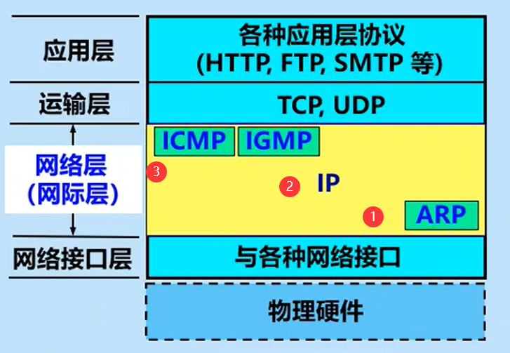 

#### 3.1 ARP协议

**使用：**

- 只在以太网中使用（即一个网段内，有交换机的广播信道上使用

  > 没有交换机即全是路由器
  >
  > 此时直接到路由表上找到下一跳路由器，走点到点链路

- 在本网段中发送ARP数据包寻找目标主机的mac地址/网关mac地址

**威胁：**

ARP欺骗

#### 3.2 IP协议

##### 3.2.1 IP数据报

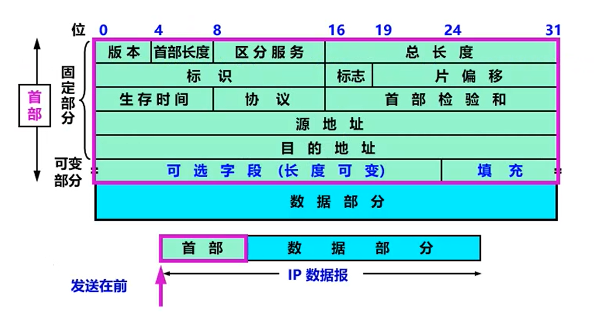 

- 首部

  - 固定部分

    - 版本：ipv4/ipv6

    - 首部长度：4位，表示0-15，首部最长可为15*4（单位） = 60个字节

    - 区分服务Qos：给数据报加上标记（DSCP），让此标记的数据报优先转发，可以保证某种应用的流量

    - 总长度：

      - 首部+数据的总长度，最大为65535
      - 如果超过最大传输单元（MTU）1500，会被分片，每个片都会重新带有首部

    - 标识：标识片是否为一个数据报分片而来

    - 标志MF：指明后面是否还有分片1/0

    - 片偏移：指明这个片开头和结尾分别是多少位

    - 生存时间TTL：

      - 数据报在网络中可以通过的路由器个数的最大值（即经过一个路由器值就减1
        - 目标主机为Linux，TTL为64
        - 目标主机为Windows，TTL为128
        - Unix或CISCO路由器，TTL为255
      - 主要用于避免环路

    - 协议：指明将数据给哪一个进程，如：ICMP/IGMP/TCP/UDP/OSPF

    - 首部检验和：检查首部有没有差错

      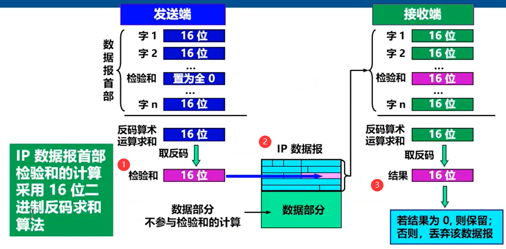 

    - 源地址

    - 目标地址

  - 可变部分

- 数据

#### 3.3 ICMP

- 探测网络是否通畅

- 发生错误时，通知主机

##### 3.3.1 ICMP报文分类

- ICMP请求报文
- ICMP响应报文
- ICMP差错报告报文

##### 3.3.2 ICMP报文格式

- ICMP首部部分：
  - ICMP报文类型（8位
    - 请求：8
    - 响应：0
    - 差错报告：3/4/5/11/12
  - ICMP报文代码（8位
    - 请求/响应：0
    - 差错报告：0/1/2/3/4/13
  - 校验和（16位
  - 首部其他部分（32位
- ICMP数据部分
  - 差错报告：产生差错的数据包的IP首部+数据字段前8个字节（例：如果是ICMP数据出现问题，此前八个字段就是发生错误的ICMP报文首部

#### 3.4 IGMP

组播管理协议

##### 3.4.1 组播/多播

实现一对多通信：一个发送端，多个接收端

**实现：**

- **一个组内**绑定一个IP地址

- 源主机只**发送**一次数据发送数据，避免多次TCP连接的建立于多次数据的发送

  > 相当于把原来主机需要复制的次数分给了路由器和交换机
  >
  > - 路由器复制
  > - 交换机硬件多播

**组播IP地址：**

- D类地址为组播地址
- 只能用于目标地址，不能用于源地址

**组播mac地址：**

- 保留mac地址+组播ip地址（后23位）

##### 3.4.2 IGMP协议

IGMP作用：

- 主机通过IGMP通知路由器要接收/离开某个组播组
- 路由器通过IGMP周期性的查询局域网内是否还有组播组成员，如果没有就提示上一个路由器不再发组播信息

### 4. IPV6

#### 4.1 IPV6报文结构

- 基本首部：40字节

  - 版本号

  - 流类别：即Qos，用于区分服务，保证某个服务的流量

  - 流标签：区分实时流量（如：语音/视频等

  - 有效载荷长度：即扩展首部和数据部分的长度

  - 下一个首部：第一个扩展首部类型/数据部分的上一层协议类型

    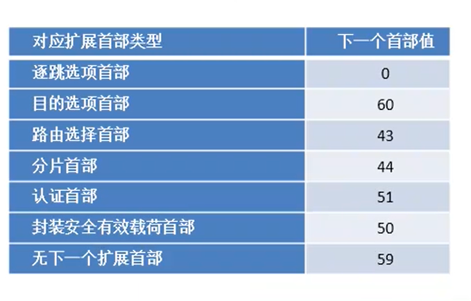 

  - 跳数限制：即TTL

  - 源地址

  - 目标地址

- 扩展首部
  - 也有下一个首部
- 数据部分

#### 4.2 IPV6地址编址

##### 4.2.1 地址组成

128 = 8 * 16（4网络+4主机

16 = 4 * 4（16进制）

| xxxx | :xxxx | :xxxx | :xxxx | :xxxx | :xxxx | :xxxx | :xxxx |
| ---- | ----- | ----- | ----- | ----- | ----- | ----- | ----- |

如：FE80 =》 1111 1110 1000 0000

##### 4.2.2 分类

- 组播地址：FF开头
  - 组播地址应用：检验单播/任播地址是否冲突：固定组播地址前缀104位+单播/任播地址后24位
- 单播地址
  - 分类：
    - 全球单播地址：相当于公网地址
      - 全球路由前缀3
      - 子网1
      - 主机部分4
    - 唯一本地地址：相当于私网地址 FC00::/7
    - 链路本地地址：FE80::/10
    - 特殊地址
    - 其他单播地址
  - 组成
    - 网络地址
    - 主机地址：IEEE EUI-64格式 由mac地址转换而来
- 任播地址
  - 多个主机都设为一个地址 任意访问一个都可
  - 常用来做服务的冗余 不同地区访问地址相同且离其最近的主机

## 五、传输层

### 1. TCP

TCP为应用层提供可靠传输

- 发送端按顺序发送，接收端按顺序接收（数据报到达应该是无序的，因为ip协议是无状态的）
- 期间发生丢包、乱序等，TCP负责重传和排序

#### 1.1 应用场景

- 需要多次交互
- 传输较大数据，需要分段传输

#### 1.2 特点

- 面向连接，即正式传输之前会先建立连接，确定传输时的参数
- 点到点通信，即只能一对一
- 可靠交付：无差错、不丢失、不重复的按序发送和接收
- 全双工通信
- 面向字节流，即应用程序交给传输层的数据形式为**字节流**的形式，传输层自己分段（根据对方给出的窗口值和当前网络拥塞程度来决定一个报文段大小

#### 1.3 功能

- 建立连接
- **可靠传输**
- **流量控制**
- **拥塞避免**
- 释放连接

#### 1.4 TCP报文格式

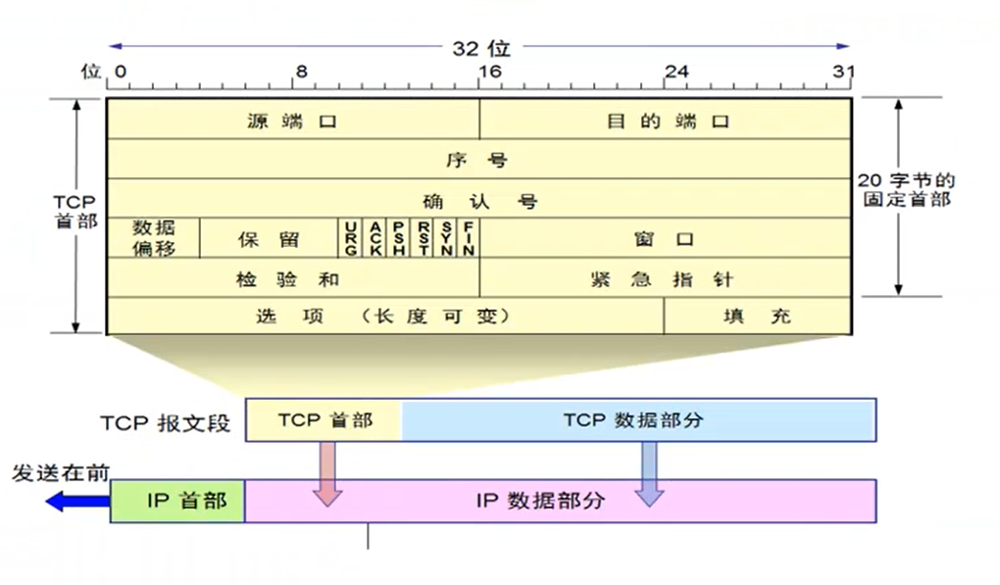 

- 首部
  - 源端口：0-65535（2^16-1=65535
  - 目标端口：0-65535（2^16-1=65535
  - 序号Seq：表示数据部分最开始是整个文件的第多少个字节（以随机生成一个基础值为0
  - 确认号ack：确认数据报才有，值为没有收到的第一个字节是多少（即告诉发送方应该发第多少个字节了
  - 数据偏移：
    - 即首部长度，2^4-1=15 15*4=60
    - 即首部最大长度为60个字节，选项部分最大长度为40字节
  - 保留
  - 六位标记位：即标记哪些字段有意义，只有0/1
    - URG：紧急指针标记
    - ACK：确认号标记
    - PSH：标记，发送的报文希望对方尽快处理，常和紧急指针一起使用
    - RST
    - SYN：同步标记位，即建立连接标记
    - FIN：关闭连接标记
  - 窗口win：通过调整窗口 来实现流量控制（接收方调整自己的窗口大小，发送方跟着接收端调整
  - 检验和：检验首部和数据部分
  - 紧急指针：指出本报文段中的紧急数据（指命令行的命令）的字节数（紧急部分后面就是普通数据
  - 选项：TCP通信之前协商参数
    - MSS
    - SACK
  - 填充：填充选项，凑够四字节整数倍
  
- 数据部分
  - 当发送的数据报为确认数据报时，数据部分为空，即只有首部

#### 1.5 可靠传输

##### 1.5.1 停止等待协议

**提出背景：**

- 信道传输数据的时候可能丢失
- 接受方在接收数据时可能忙不过来

**停止等待协议：**

每发送完一个分组就停止发送，等待对方确认：

- 收到确认，发送下一个分组
- 没有收到确认
  - 发送分组丢失：重传
  - 确认丢失：重传，接收方丢掉重复分组
  - 确认迟到：重传，当收到迟到的确认时，什么也不做

> 注：
>
> - 发送端每发送数据包都要暂时保留已发送的分组的副本
> - 分组和确认分组都要编号
> - 自动重传协议ARQ：即不需要请求方请求重传，发送方没有收到确认时自动重传

##### 1.5.2 改进的停止等待协议

即连续ARQ协议和滑动窗口协议，提高信道利用率

**原理：**

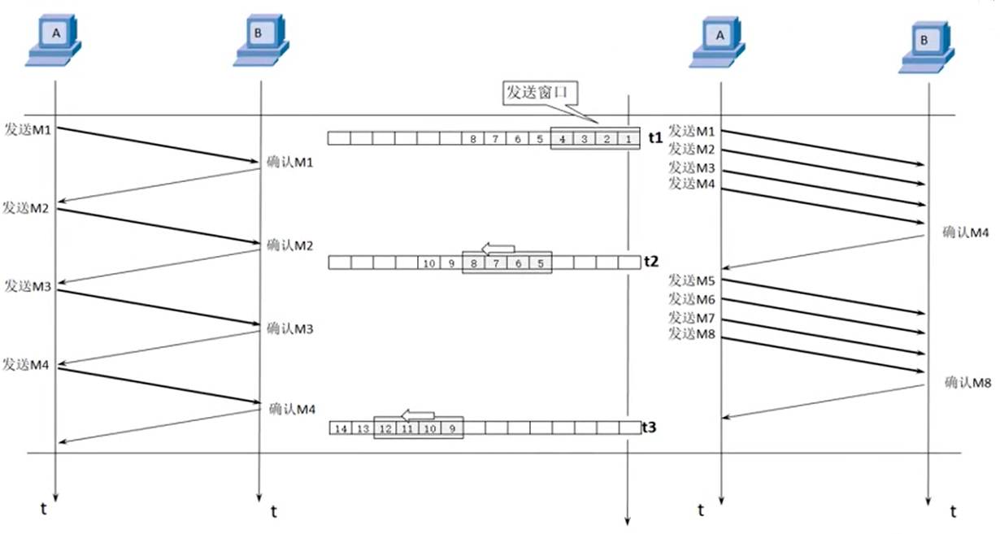 

发送一系列分组，再等待这一系列分组的确认（分组的多少由网络状态决定

**实现：**

1. **以字节为单位的滑动窗口技术**

   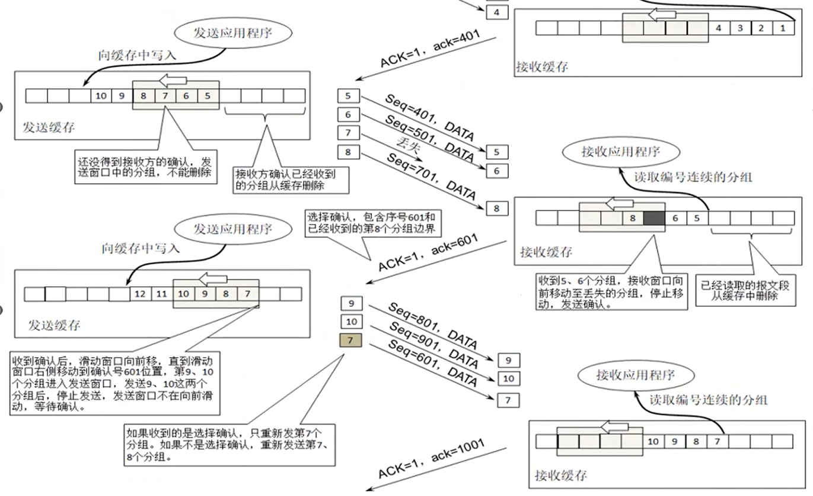 

   - 收到确认后，并不会立即发送丢了的数据报，而是先发送窗口中没有发送的数据报，丢失的数据报在超时之后才会自动重传

2. **超时重传时间的选择**

   往返时间RTT传输：

   - TCP首部的时间戳选项
   - 重传队列中数据报的TCP控制块

   

   RTT计算：

   - 建立TCP连接的时候就可以计算出往返时间RTT
   - 新的RTTs = (1-α) * 旧RTTs + α * 新RTT样本

    

   超时重传时间RTO：

   RTO = RTTs + 4 * RTTd

3. **选择确认SACK**（可见上图

   即会告诉发送端 接收到的数据的边界

   在选项中增加SACK选项

   - 选项类型1
   - 选项长度1
   - 左边界4
   - 右边界4

#### 1.6 流量控制

##### 1.6.1 滑动窗口实现流量控制

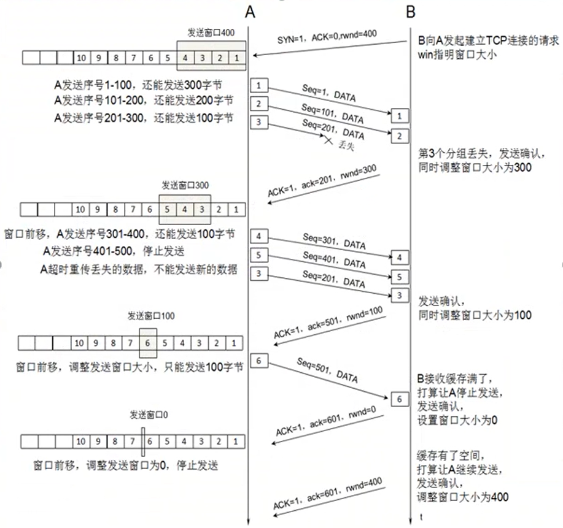 

##### 1.6.2 TCP传输效率

**TCP报文发送时机：**

- TCP维持变量=MSS，当缓存中字节数到达MSS大小时，就封装成一个TCP报文段发出
- 发送方应用进程指明要求发送报文段
- 发送方计时器期限到了

**Nagle算法：**

- 先发送第一个数据字节
- 是否收到确认
  - 收到确认，将缓存中的数据立即发送
  - 没有收到确认，但缓存中字节数到达MSS，立即发送

**糊涂窗口综合症：**

- 产生原因：接收方应用进程消耗太慢，告诉发送方每次仅发一个或几个很少的字节。导致发送方的糊涂窗口综合征
- 解决：让发送方等待一段时间

#### 1.7 拥塞避免

> 流量控制是端到端的控制（两个主机之间控制
>
> 拥塞避免是网络的控制

##### 1.7.1 慢开始和拥塞避免

**慢开始：**

- 最开始的时候 发送窗口=拥塞窗口=1

- 如果没有问题，则发送窗口和拥塞窗口依次成倍增加

- 直到到达慢开始门限值，发送窗口和拥塞窗口指数增加

- 直到遇到网络拥塞

  - 慢开始门限=网络拥塞值/2
  - **发送窗口=拥塞窗口=1**

  

##### 1.7.2 快重传和快恢复

**快重传：**

- 即在接收方一旦发现数据报没有按顺序达到，就立即连发三个重复确认
- 发送方就会立刻重发丢失的数据包

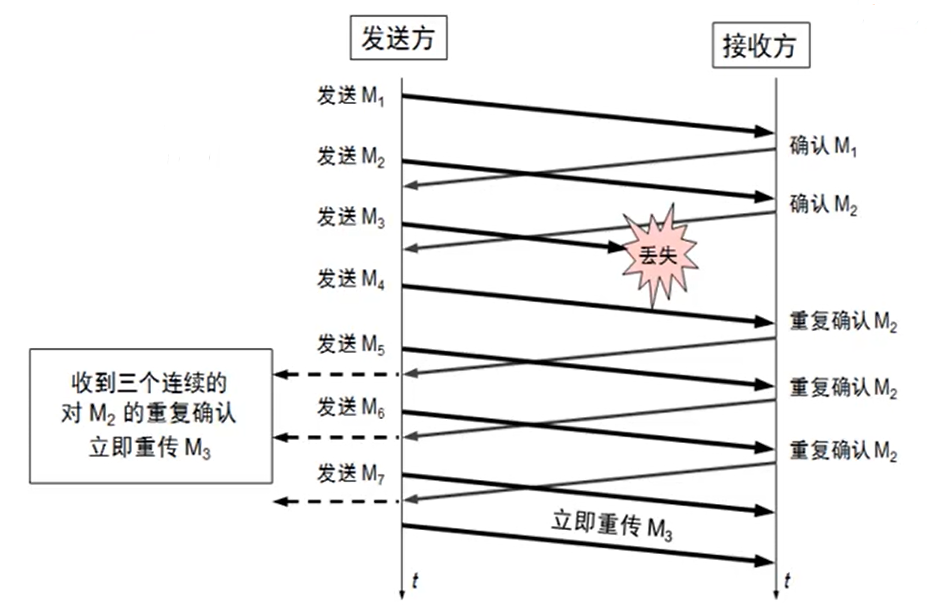  

**快恢复：**

在慢开始的基础上改进

- 最开始的时候 发送窗口=拥塞窗口=1
- 如果没有问题，则发送窗口和拥塞窗口依次成倍增加
- 直到到达慢开始门限值，发送窗口和拥塞窗口指数增加
- 直到遇到网络拥塞
  - 慢开始门限=网络拥塞值/2
  - **发送窗口=拥塞窗口=慢开始门限 然后开始指数增加**

#### 1.8 TCP连接管理

##### 1.8.1 三次握手

- 建立连接
  - SYN=1 ACK=0 
  - seq=0 ack=0
  - MSS=1460 SACK win
  - 没有数据部分
- 确认
  - SYN=1 ACK=1
  - seq=0 ack=1
  - MSS=1460 SACK win
  - 没有数据部分
- 确认的确认
  - SYN=0 ACK=1
  - seq=1 ack=1
  - 没有数据部分

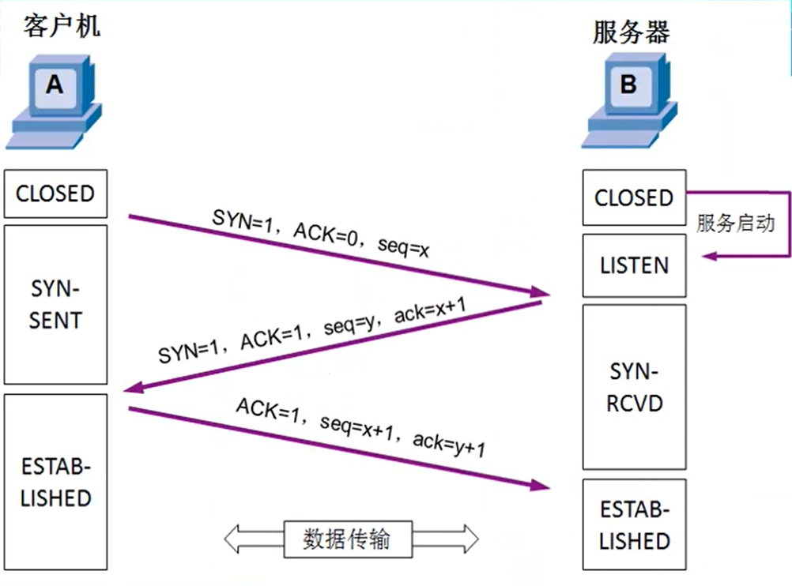 

SYN攻击：修改源IP地址，并且只发送一次建立连接请求（即TCP三次握手只完成两次），占用服务器资源

##### 1.8.2 四次挥手

- 释放连接
  - FIN=1 ACK=0
  - seq=u
- 确认
  - ACK=1
  - seq=v ack=u+1
- 释放连接
  - FIN=1 ACK=1
  - seq=w ack=u+1
- 确认
  - ACK=1
  - seq=u+1 ack=w+1

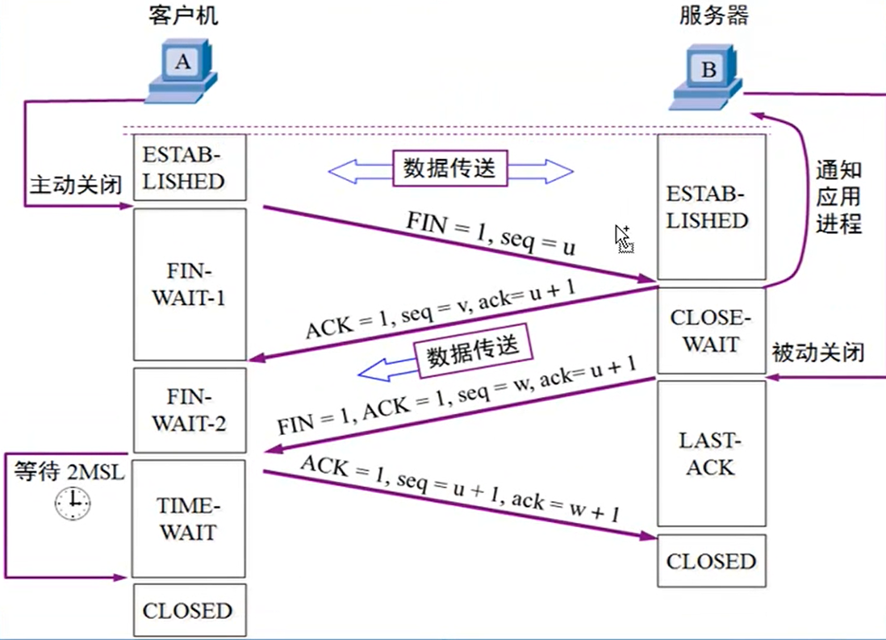 

##### 1.8.3 TCP的有限状态机

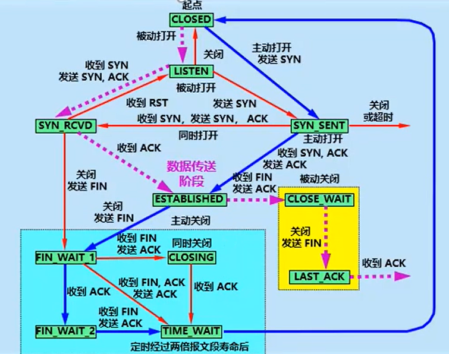 

### 2. UDP

UDP不提供可靠传输

#### 2.1 应用场景：

- 数据报不需要分段
- 实时通信：需要实时通信，延迟尽量低，如qq/微信语音/视频聊天等
- 多播/广播通信

#### 2.2 特点

- 无连接
- 不保证可靠交付，不维持连接状态
- 面向报文：即不对报文进行合并/拆分，直接封装应用层的报文
- 没有拥塞控制
- 支持一对一、一对多、多对一、多对多通信
- 首部开销小，8个字节

#### 2.3 功能

- 复用和分用：即在首部加上端口
  - 让一个计算机只实现一次UDP，但可以支持多个应用层协议/应用程序使用
- 差错检测

#### 2.4 UDP报文格式

- 伪首部：12字节
  - 源IP地址
  - 目标IP地址
  - 0
  - 17
  - UDP长度
- 首部：8字节
  - 源端口
  - 目的端口
  - 长度：UDP数据报长度，最小为8（即仅有首部
  - 检验和：伪首部+首部+数据部分反码运算求和 将结果再求反码即可
- 数据部分

### 3. 传输层和应用层协议

#### 3.1 关系

传输层协议+端口号 **标识** 应用层协议（端口复用技术，用端口区分协议

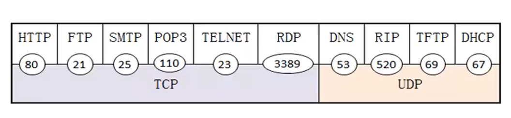 

#### 3.2 端口

- 16位端口号 => 65535个端口号
- 端口只具有本地意义，即端口号只标记了本计算机应用层中的各进程

**分类：**

- 服务端
  - 熟知端口0-1023：为熟知的应用程序保留
  - 登记端口号1024-49151：没有熟知的应用程序使用
- 客户端
  - 短暂端口号49152-65535：即临时的端口

**服务和端口之间的关系：**

端口用来定位服务器上的服务，监听端口就可以知道此服务是否需要提供

## 六、网络层

### WWW

#### 1. www

网站的超链接

#### 2. URL

标识互联网上的唯一文档

格式：<协议>://<主机或域名>:<端口>/<路径>

- 协议：http ftp等
- 有时还能加入其他字段 如ftp连接里面还可以加上用户名密码等

#### 3. HTTP协议

**特点**

- TCP保证传输层的可靠传输
- 无连接：通信双方在交换http报文之前不需要先建立http连接
  - 对应无状态，无需考虑请求之间的任何关系
- 无状态：即服务器不会记录客户端访问，不存储客户的状态信息

**要求**

服务器必须按照客户端请求的先后顺序依次回送相应的结果，以保证客户端能够区分出每次请求的响应内容

##### 3.1 HTTP1.0 

**过程**

背景：服务端进程监听TCP的80端口，等待客户端建立连接

1. 客户端收到建立连接请求，建立TCP连接
2. 客户端发送请求报文
3. 服务端响应报文，返回响应页面
4. TCP连接释放

> 短连接：请求一次之后马上断开TCP连接，下次请求需重新建立TCP连接

**问题**

- 无法复用连接，每次建立连接开销大，降低网络利用率
- 队头阻塞：即上一个请求的响应到达之后下一个请求才能发出

**实例**

套接字编程，使用Socket进行http请求：

-  

- 代码示例：

   

  

##### 3.2 HTTP1.1 

**与1.0的区别：**

1. 长连接：服务器发送响应后一段时间内仍然保持连接，即一次TCP连接可以供多轮使用（在同一个服务器上的资源）
   - 非流水线方式：客户端收到前一个响应之后才能发出下一个请求
   - 流水线方式：可以持续发送请求
2. 管道化：即相当于先进先出队列的迁移，发送到对方的时候依旧是有序的，但依然效率较低

##### 3.3 代理服务器

**概念：**

代理服务器是一种高速缓存，将最近的一些请求和响应暂存到代理服务器的本地磁盘中

新请求到达时，若发现与暂存的请求相同，就直接返回暂存的请求

应用：

- 提高访问速度

- 控制流量
- 绕过防火墙

##### 3.4 HTTP报文结构

请求报文：客户端向服务器发送请求

- 请求行
  - 方法：GET POST等
- 首部行
- 空行
- 实体

响应报文：服务器响应客户端

- 状态行
  - 状态码：三位数字
- 首部行
- 空行
- 实体

##### 3.5 Cookie

因为http协议的无状态特性，所以增加了cookie用来保存用户的身份

流程：

- 首次访问某个站点时，服务器生成一个唯一的识别码
- 服务器在响应报文中的Set-cookie字段放入识别码
- 客户端收到后 存入缓存/硬盘，放入主机名和识别码
- 客户端在以后的同类请求（默认）中都会加上cookie
  - 同类请求：资源路径相同的请求（URL=资源路径+资源名称）

应用场景：

- 跟踪用户行为/访问过的页面
  - 不一定登陆，登陆后需跟个人信息等关联
  - 将cookie存入后端数据库，并保存跟踪记录
  - 将cookie存入客户端的硬盘中
  - 更改携带cookie的domain域和path路径
- 登陆时记住密码（保存用户名和密码）

> cookie相当于在无状态的http协议上建立了一层用户会话层

##### 3.6 Session

流程：

- 前端发送用户名和密码到后端
- 后端经过验证后生成sessionId，并将sessionId放入cookie中
- 后端存储session（要进行登陆认证）
- 前端访问带上session（通过登陆认证）

应用场景：

- 前后端鉴权

##### 3.7 缓存机制

###### 缓存资源存储

- 硬盘缓存：css等文件，因为只需要加载一次即可渲染，不需要反复加载
- 内存缓存：js等脚本文件，可能随时需要执行

###### 三级缓存原理

- 先到内存中寻找资源
- 如果没有资源再到硬盘中寻找
- 如果没有就向目标网站发出请求
- 将请求存入内存和硬盘，并加载到页面

###### 缓存分类

- 强缓存
  - expires：
    - 用于http1.0
    - 存储过期的绝对时间，但当客户端和服务器时间偏差较大时，会导致缓存混乱
  - cache-control：
    - max-age/no-cache/no-store/private/public
    - 用于http1.1·
    - 存储过期的相对时间，相对于请求的时间
  - 可以同时使用，同时使用时后者优先级更高
- 协商缓存
  - last-modified/if-modified-since：
    - 服务端返回客户端服务器上 上一次文件修改时间
      - 如果服务器上此时间之后没有修改 则返回304，客户端将在缓存中加载资源并显示
      - 如果修改则返回200 并将旧资源移除，新资源放入缓存
  - etag/if-none-match：服务端返回客户端校验码
  - 可以同时使用，同时使用时后者优先级更高

###### 缓存机制

- 判断是否命中强缓存，若命中则直接从缓存中加载资源
- 如果没有命中强缓存，则判断是否命中协商缓存，若命中则直接从缓存中加载资源
- 如果都没有命中则保存并加载新资源（如果返回新资源会在协商缓存结果中，所以此时不需要再请求新资源）

#### 4. 万维网文档

